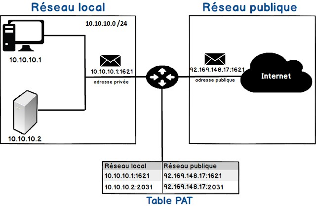
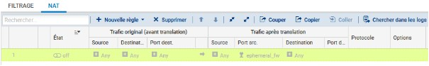
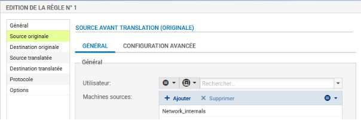
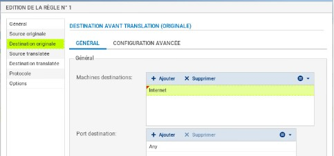
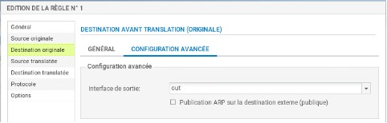
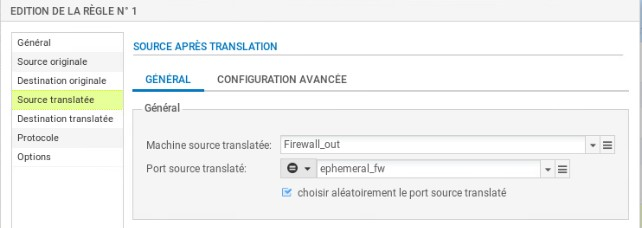
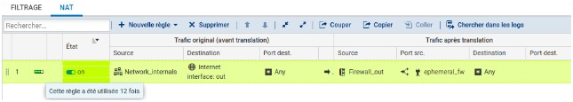
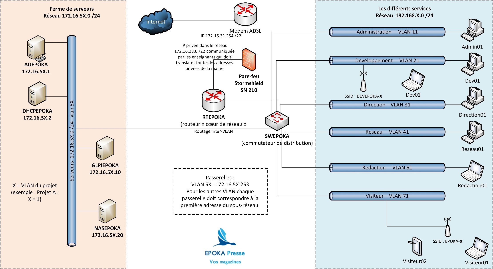

# Activités Professionnelles
## Situation professionnelle
### Introduction – Infrastructure et services réseaux SP0
{ align=center width="250" }
---

### Méthode de gestion du projet informatique

Le travail en équipe rend inévitable l’utilisation d’un outil collaboratif (ex : **ELEA** dans Netocentre, cours :  
« AP-SIO2-SISR-2025 »).

Vous devez rendre dès la première séance :  
- La **liste des tâches intermédiaires** pour chaque mission (exemple : prototypage de l’architecture réseau).  
  Une tâche intermédiaire correspond à un élément *livrable* de la mission.  
- La **répartition des tâches** entre les membres de l’équipe.  
- Les **dates prévisionnelles de livraison** de chaque mission.  

Pour cela, vous utiliserez l’application en ligne **[Notion](https://www.notion.so)**.

**Nombre d’étudiants :** 2  
**Date de livraison de l’ensemble de la situation :** 29/09/2025  

---

## Présentation de la situation

La société **EPOKA Presse** dispose d’un réseau accueillant l’ensemble de ses services.  
Chaque poste dispose d’une **adresse IP fixe** attribuée par l’administrateur réseau selon un plan d’adressage (Document 2).

### Problèmes constatés :
- Ralentissements fréquents du trafic réseau.  
- Installation récente d’une **ferme de serveurs NUTANIX (hyperviseur AHV)** par la société Bull.  
- Les serveurs virtuels hébergés doivent être adressés dans la plage **172.16.5X.0 /24**  
  (X = 1 pour le VLAN 51, X = 2 pour le VLAN 52, etc.).

---

## Missions à réaliser

### Mission 1 – Adapter le plan d’adressage aux nouveaux besoins

La société souhaite segmenter son réseau **192.168.X.0 /24** à l’aide de la méthode **VLSM (Variable Length Subnet Mask)**.  
Le réseau *serveurs* reste inchangé.  
Vous disposez du nombre d’hôtes par service dans **l’annexe 2** et devez ajouter **20 % de marge** d’adresses par sous-réseau.  

> 👉 Objectif : proposer un nouveau plan d’adressage pour l’ensemble des services (à faire valider par un enseignant).

---

### Mission 2 – Mise en place d’un contrôleur de domaine et d’un service DHCP

#### Contexte :
Une ferme de serveurs sous **NUTANIX (AHV)** a été installée.  
Vous devez configurer **deux serveurs virtuels** respectant le plan d’adressage.

#### 1. Serveur ADEPOKA
- **Nom :** ADEPOKA  
- **IP :** 172.16.5X.1  
- **OS :** Windows Server 2019  
- **Services :** DNS dynamique, Active Directory  
- **Domaine :** local.epokaX.lan  
- Peupler l’AD via un **script PowerShell** et un **fichier CSV** fourni sur Moodle.  
  Ajouter les commentaires expliquant les structures de programmation utilisées.

#### 2. Serveur DHCPEPOKA
- **Nom :** DHCPEPOKA  
- **IP :** 172.16.5X.2  
- **OS :** Debian  
- **Service :** DHCP (tous les sous-réseaux en adressage dynamique, sauf le réseau serveurs).  
- Distribuer les paramétrages réseau à tous les sous-réseaux.

---

### Mission 3 – Mise en place d’un serveur de gestion d’incidents et d’un serveur NAS

#### Serveur de gestion d’incidents (GLPI)
- **Nom :** GLPIEPOKA  
- **IP :** 172.16.5X.40  
- **OS :** à déterminer et justifier  
- **Service :** gestion d’inventaire et de tickets d’incident  
- **Responsables :**
  - Olivier TONDET : solutions techniques et interconnexions  
  - Pamela TREMO : services et systèmes serveurs  

#### Serveur NAS
- **Nom :** NASSCA  
- **IP :** 172.16.5X.20  
- **OS :** à déterminer  
- **Service :** gestion des sauvegardes  
- **Configuration :**
  - RAID 5  
  - Minimum 20 Go disponibles  
  - Accès via authentification Active Directory

---

### Mission 4 – Mise en place d’une partie de l’architecture réseau

Sur la base des documents 2 et 3, configurer :
- un **commutateur d’accès** (segmentation + plan d’adressage)  
- un **routeur** (routage inter-VLAN)  
- un **pare-feu Stormshield SN210** (sécurité réseau)

> Utiliser **Packet Tracer** pour modéliser et tester la maquette.  
> Les tests doivent vérifier le routage et la distribution DHCP sur tous les services.

---

## Contraintes matérielles et technologiques

- Ferme de serveurs **NUTANIX (AHV)**  
- Licence **Windows Server 2019** (Active Directory + DNS)  
- **Linux Debian** pour les services utilisateurs et DHCP  
- **Routeur Cisco 1921**  
- **Pare-feu Stormshield SN210**  
- **Commutateur Cisco 2960**  
- **Borne Wi-Fi D-Link**  
- **Ordinateur portable**  
- Traduction NAT/PAT par le routeur cœur de réseau avec une **adresse IP privée fournie par le professeur**

---

## Document 1 – Définition et mise en place du PAT

Source : [WayToLearnX](https://waytolearnx.com/2018/07/difference-entre-nat-et-pat.html)

### Définition
Les protocoles **NAT** (Network Address Translation) et **PAT** (Port Address Translation) permettent à des hôtes privés d’accéder à Internet via une adresse publique routable.  
Le **PAT** associe plusieurs adresses locales à une seule adresse IP publique en ajoutant un **numéro de port unique** pour chaque connexion.

> Nombre maximal de traductions NAT : **65 536 (port sur 16 bits)**.
{ align=center width="700" }

---

## Pare-feu Stormshield – Configuration du NAT dynamique

Les règles de filtrage et NAT sont regroupées dans une **politique unique** (10 maximum, une seule active).  
La règle **NAPT (masquerading)** permet aux machines internes d’accéder à Internet via la traduction des ports.

**Procédure :**
1. Créer une **nouvelle règle** → *règle de partage d’adresse source (masquerading)*
{ align=center width="700" }
  
2. Définir :
   - **Source :** Network_internals  
   - **Destination :** Internet

{ align=center width="700" }

{ align=center width="700" }
  
   - **Interface de sortie :** out
{ align=center width="700" }
  
3. **Source translatée :** Firewall_Out
{ align=center width="700" } 
 
4. **Port source translaté :** ephemeral_fw (choix aléatoire conseillé)
{ align=center width="700" }
  
5. **Activer la politique**

{ align=center width="150" }

---

## Document 2 – Nombre d’hôtes dans le parc EPOKA Presse

| VLAN | Service | Nombre d’hôtes (hors passerelles) |
|:----:|:---------|:--------------------------------|
| 11 | Administration (RH / Compta / Juridique / Secrétariat) | 45 |
| 21 | Développement | 20 |
| 31 | Direction | 12 |
| 41 | Réseau | 8 |
| 61 | Rédaction | 50 |
| 71 | Visiteurs | 25 |
| 5X | Serveurs (X=1 VLAN 51, X=2 VLAN 52, etc.) | — |

---

## Document 3 – Extrait de l’architecture réseau attendue

{ align=center width="700" }

---
