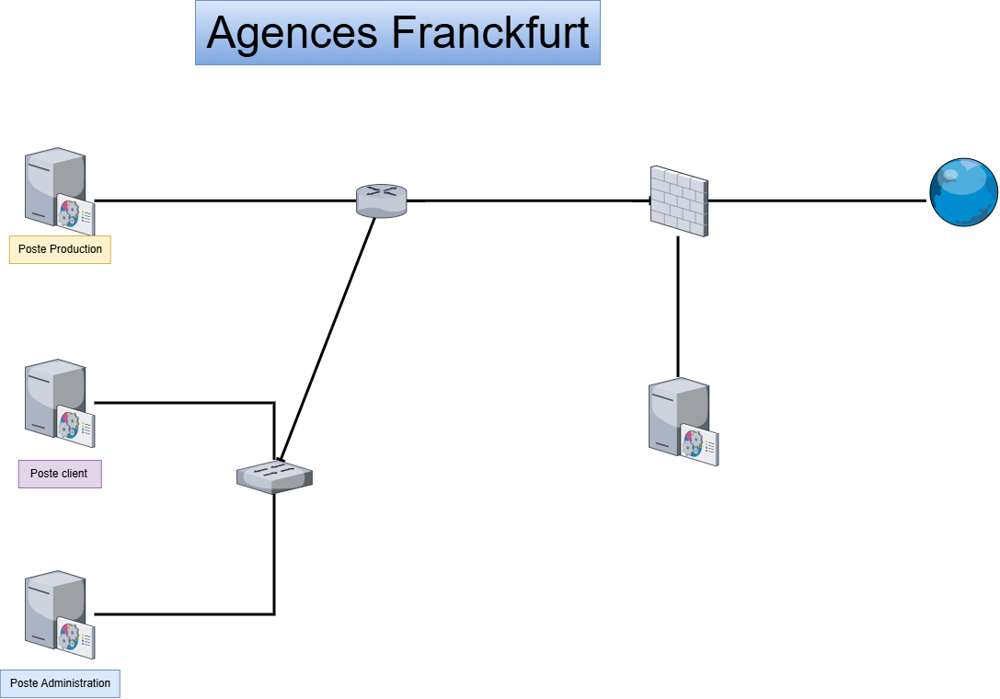

# Situation0 - AdminInfra - CUB
{ align=center width="700" }

## Mise en place de l’infrastructure réseau des agences de l’entreprise CUB  

**Présenté par :** Joris Texier  
**Date de rédaction :** 03 septembre 2025  
**Version :** 1  

---

## Sommaire

- I) Phase d’analyse et de maquettage
  - Schéma logique
  - Schéma physique
  - Schéma de câblage
  - Table de routage
  - Table de NAT
  - Maquette Packet Tracer : Configuration des switch et routeur CUB
- Mise en place du prototypage
  - Pare-feu Stormshield
  - Routage
  - NAT
- Test

---

## I) Phase d’analyse et de maquettage

1. La présence d’un seul réseau local pose un problème de sécurité :  
   l’administration des serveurs et autres équipements s'effectue au même endroit que la production et les clients.  
   Je propose de créer **3 sous-réseaux** afin de pouvoir prendre en compte les différents services.

Pour pouvoir déterminer le plan d’adressage, on va se servir de ce tableau afin de pouvoir calculer chaque sous-réseau :

| n | 1 | 2 | 3 | 4 | 5 | 6 | 7 | 8 |
|---|---|---|---|---|---|---|---|---|
| 2^n | 2 | 4 | 8 | 16 | 32 | 64 | 128 | 256 |
| 2^n - 2 | 0 | 2 | 6 | 14 | 30 | 62 | 126 | 254 |
| 32 - n | /31 | /30 | /29 | /28 | /27 | /26 | /25 | /24 |

---

### VLAN 56 – Sous-réseau Production (120 hôtes)

| Élément | Format binaire | Format décimal pointé |
|----------|----------------|------------------------|
| Masque | 1111 1111.1111 1111.1111 1000 0000 | 255.255.255.128 (/25) |
| Adresse réseau | 1100 0000.1010 1000.0000 0110.0000 0000 | 192.168.6.0 |
| Adresse 1er hôte | ...0001 | 192.168.6.1 |
| Adresse dernier hôte | ...1110 | 192.168.6.125 |
| Adresse de diffusion | ...1111 | 192.168.6.127 |
| Adresse de passerelle | ...1110 | 192.168.6.126 |

---

### VLAN 10 – Sous-réseau Clients (32 hôtes)

| Élément | Valeur |
|----------|--------|
| Masque | 255.255.255.192 (/26) |
| Adresse réseau | 192.168.6.128 |
| Adresse 1er hôte | 192.168.6.129 |
| Adresse dernier hôte | 192.168.6.189 |
| Adresse de diffusion | 192.168.6.191 |
| Adresse de passerelle | 192.168.6.190 |

---

### VLAN 20 – Sous-réseau Administration (6 hôtes)

| Élément | Valeur |
|----------|--------|
| Masque | 255.255.255.240 (/28) |
| Adresse réseau | 192.168.6.192 |
| Adresse 1er hôte | 192.168.6.193 |
| Adresse dernier hôte | 192.168.6.205 |
| Adresse de diffusion | 192.168.6.207 |
| Adresse de passerelle | 192.168.6.206 |

---

### Schéma logique

{ align=center width="700" }

---

### Schéma physique

{ align=center width="700" }

---

### Schéma de câblage

{ align=center width="700" }

---

## Table de routage

### Switch N3

| Type | Réseau de destination | Masque | Passerelle | Interface |
|------|-----------------------|---------|-------------|------------|
| connecté | 192.168.6.0 | /25 | 192.168.6.126 | 192.168.6.126 |
| connecté | 192.168.6.128 | /26 | 192.168.6.190 | 192.168.6.190 |
| connecté | 192.168.6.192 | /28 | 192.168.6.206 | 192.168.6.206 |
| connecté | 192.168.66.248 | /28 | 192.168.66.253 | 192.168.66.253 |
| statique | 0.0.0.0 | /0 | 192.168.66.254 | 192.168.66.253 |

---

### Pare-feu Stormshield

| Type | Réseau de destination | Masque | Passerelle | Interface |
|------|-----------------------|---------|-------------|------------|
| connecté | 192.36.6.0 | /24 | 192.36.6.254 | 192.36.6.254 |
| connecté | 192.36.253.0 | /24 | 192.36.253.60 | 192.36.253.60 |
| connecté | 192.168.66.248 | /28 | 192.168.66.254 | 192.168.66.254 |
| statique | 192.168.6.0 | /24 | 192.168.66.253 | 192.168.66.254 |
| statique | 0.0.0.0 | /0 | 192.36.253.254 | 192.36.253.60 |

---

## Table de NAT – Pare-feu Stormshield

| Avant translation | Après translation |
|-------------------|-------------------|
| ip source 192.168.6.0/24 → ip dest 192.36.253.60 |
| ip source 192.168.66.240/28 → ip dest 192.36.253.60 |

---

## Maquette Packet Tracer

{ align=center width="700" }

### Configuration des switchs et routeur CUB
*(à insérer ici les commandes ou captures)*

---

## Mise en place du prototypage

### Pare-feu Stormshield
*(à compléter)*

### Routage
*(à compléter)*

### NAT
*(à compléter)*

---

## Test
*(à compléter)*

---
