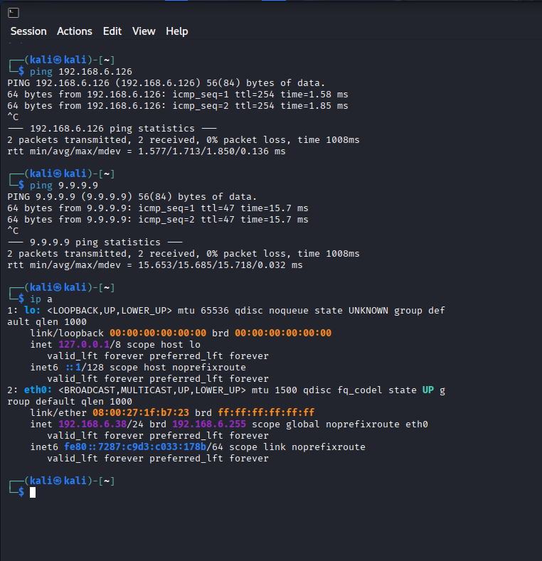
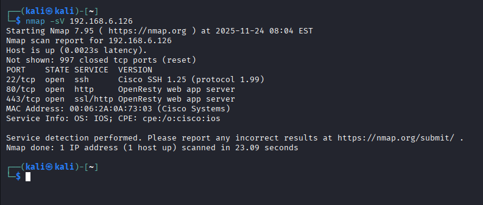

# Situation 2 – AdminInfra – CUB
{ align=center width="250" }

## Analyse réseau, découverte d’hôtes et scan de ports

**Présenté par :** Joris Texier  
**Date de rédaction :** 24 novembre 2025  
**Version :** 1

---

## Sommaire

- I. Contexte
- II. Découverte réseau
- III. Scan de ports
- IV. Analyses réseau
- V. Pour aller plus loin

---

## I. Contexte

L’équipe spécialisée SSI (sécurité du système informatique) de l’entreprise **CUB** décide  
d’intervenir au sein de votre agence afin de réaliser un **test d’intrusion**.

Vous accompagnez l’un des techniciens dans l’étape de **collecte d’informations**.

Une **machine virtuelle Kali Linux** est utilisée dans le **VLAN production** (mode *bridge* sur VirtualBox).

### Vérifications réseau

```bash
ip a
```

```bash
ping <adresse_vlan>
```

```bash
ping google.com
```
{ align=center width="250" }

---

## II. Découverte réseau

Découverte des hôtes présents sur le réseau :

```bash
nmap -sP 192.168.6.0/24
```

---

## III. Scan de ports

### Scan TCP

```bash
nmap -sS 192.168.6.126
```

```bash
nmap -sV 192.168.6.126
```

### Scan UDP

```bash
nmap -sU 192.168.6.126
```
{ align=center width="250" }

---

## IV. Analyses réseau

- Connexion SSH
- Requête DNS
- Requête HTTP
- Analyse Wireshark

---

## V. Pour aller plus loin

Étudier la légalité d’un scan de ports réalisé depuis Internet.
