# Situation 3 – AdminInfra – CUB
{ align=center width="250" }

## Mise en place de l’infrastructure réseau des agences de l’entreprise CUB

**Présenté par :** Joris Texier  
**Date de rédaction :** 03 septembre 2025  
**Version :** 1

---

## Sommaire

- Phase d’analyse et de maquettage
- Schéma logique
- Schéma de câblage
- Table de routage
- Table de NAT
- Maquette Packet Tracer
- Mise en place du prototypage
- Tests
- Filtrage réseau

---

## Phase d’analyse et de maquettage

La présence d’un seul réseau local pose un problème de sécurité.  
L’administration des serveurs et des équipements est réalisée sur le même réseau que la production et les clients.

La création de **trois sous-réseaux distincts** permet d’améliorer la sécurité :
- Production
- Clients
- Administration

---

## VLAN 56 – Sous-réseau Production (120 hôtes)

- Réseau : 192.168.6.0/25
- Passerelle : 192.168.6.126
- Adresse de diffusion : 192.168.6.127

---

## VLAN 10 – Sous-réseau Clients (32 hôtes)

- Réseau : 192.168.6.128/26
- Passerelle : 192.168.6.190
- Adresse de diffusion : 192.168.6.191

---

## VLAN 20 – Sous-réseau Administration (6 hôtes)

- Réseau : 192.168.6.192/28
- Passerelle : 192.168.6.206
- Adresse de diffusion : 192.168.6.207

---

## Schéma logique
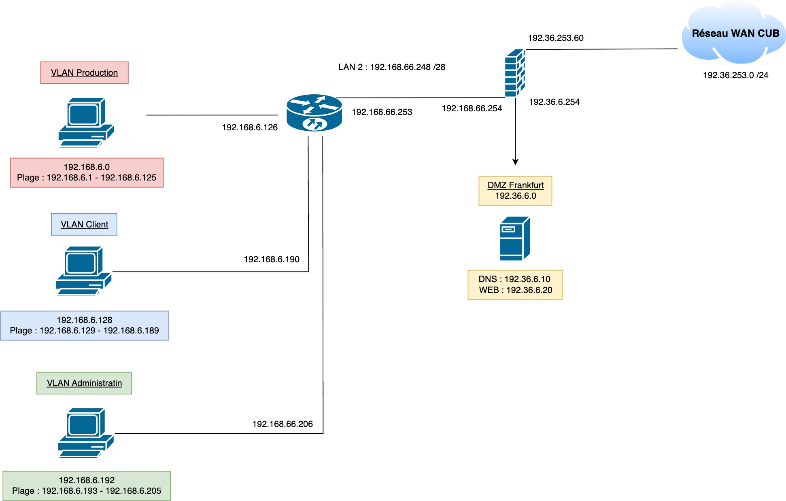{ align=center width="700" }

---

## Schéma de câblage
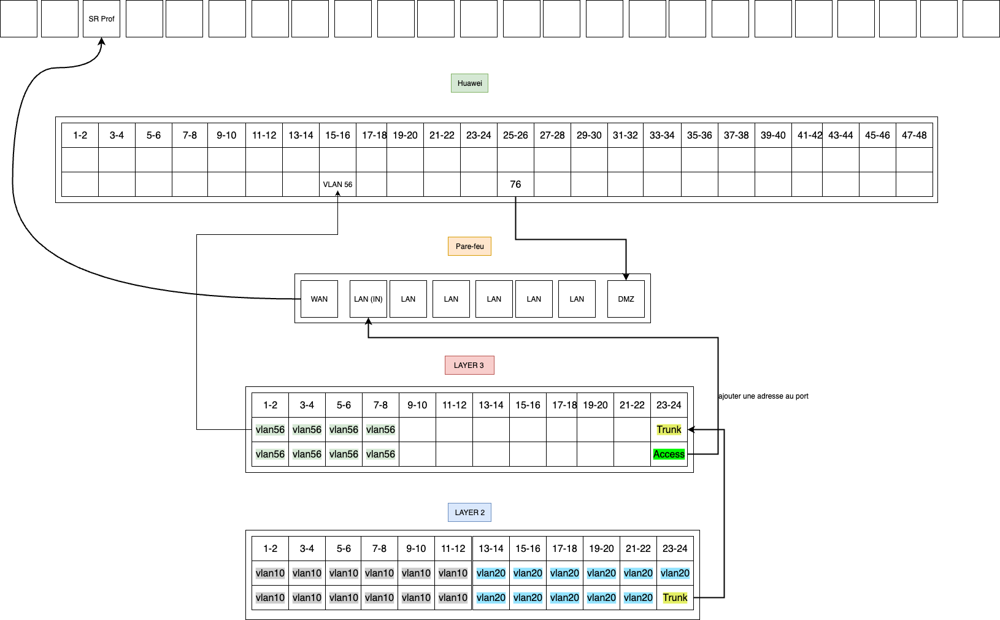{ align=center width="700" }

---

## Table de routage

### Switch N3
- 192.168.6.0/25
- 192.168.6.128/26
- 192.168.6.192/28
- Route par défaut : 192.168.66.254

### Pare-feu Stormshield
- LAN : 192.36.6.0/24
- WAN : 192.36.253.0/24

---

## Table de NAT – Pare-feu Stormshield

- 192.168.6.0/24 → 192.36.253.60
- 192.168.66.240/28 → 192.36.253.60

---

## Maquette Packet Tracer

Configuration des switches et du routeur CUB.
[Configuration des switch et routeur CUB](https://drive.google.com/drive/folders/1GXBigqVqaa86_AFHlSA7-2rDH3MePCTA?usp=sharing){:target="_blank"}

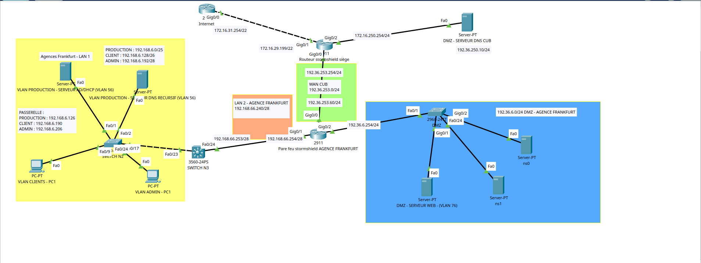{ align=center width="700" }
---

## Nouveau schéma incluant le fonctionnement du service DNS au sein de l’entreprise
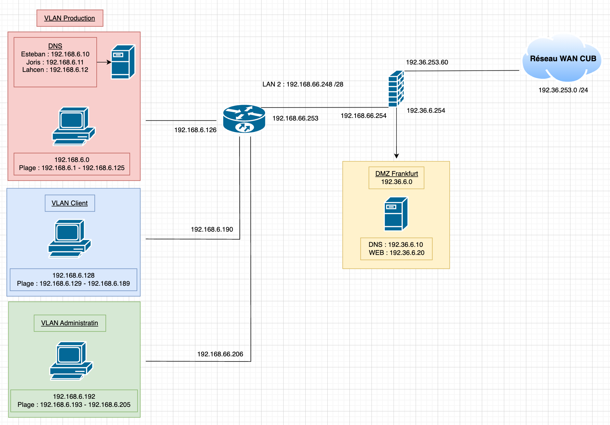{ align=center width="700" }

---

## Mise en place du prototypage

- Pare-feu Stormshield

- Routage
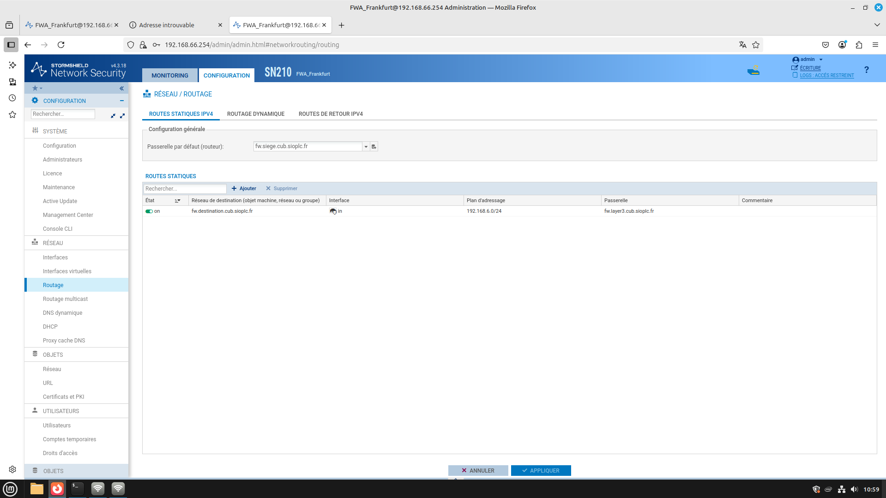{ align=center width="700" }

- NAT
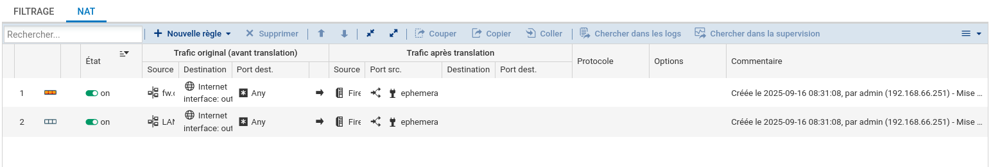{ align=center width="700" }

---

## Tests

Les tests de connectivité entre les VLAN et Internet sont concluants.
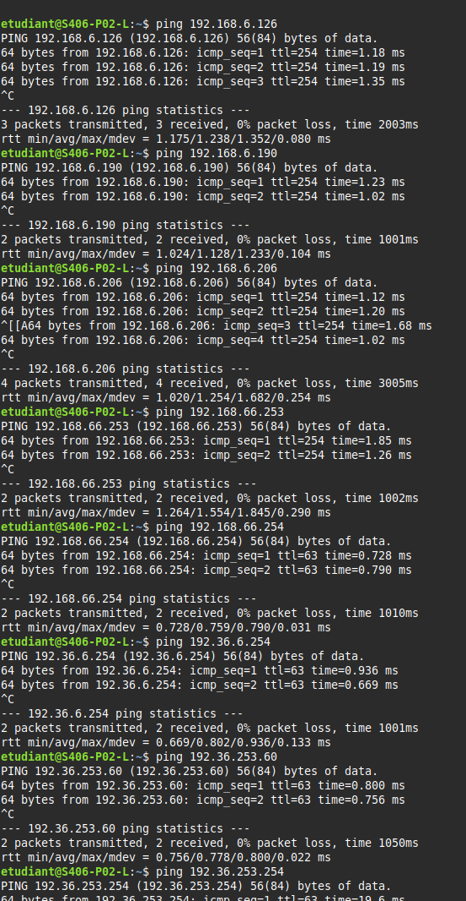{ align=center width="700" }

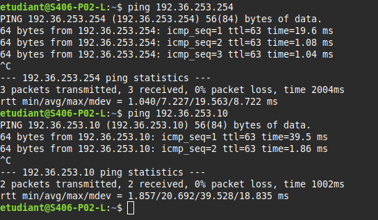{ align=center width="700" }

---

## Filtrage réseau

Mise en place d’une matrice de filtrage permettant :
- La séparation des flux
- La sécurisation des accès
- Le contrôle des communications inter-VLAN

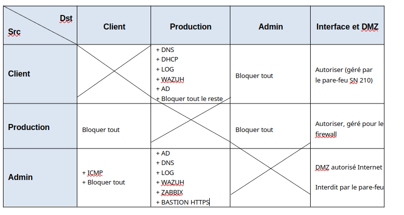{ align=center width="700" }

---

## Table de filtrage (sur routeur / Layer 3)

- Table de filtrage pour le VLAN Client
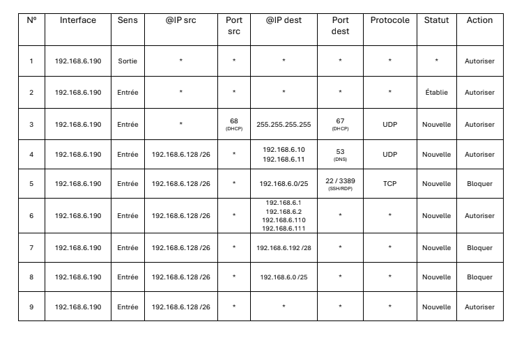{ align=center width="700" }

- Table de filtrage pour le VLAN Production
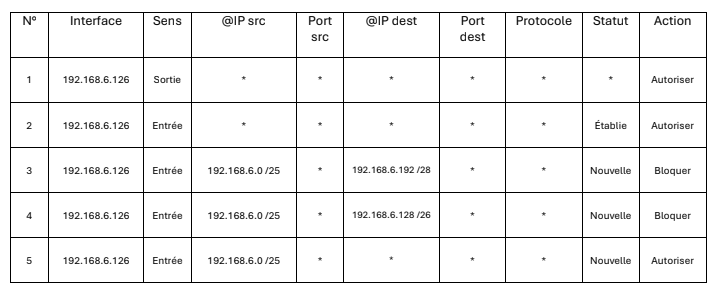{ align=center width="700" }

- Table de filtrage pour le VLAN Administration
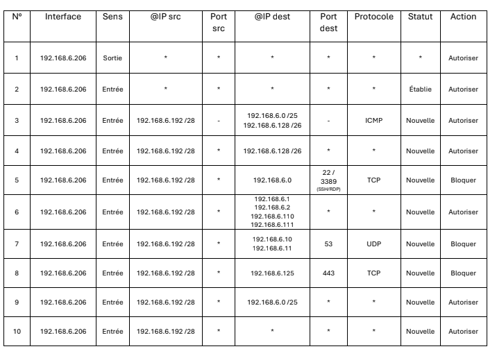{ align=center width="700" }

