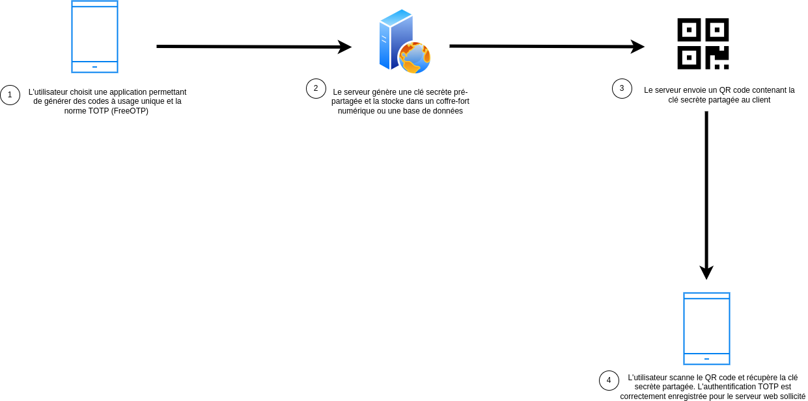
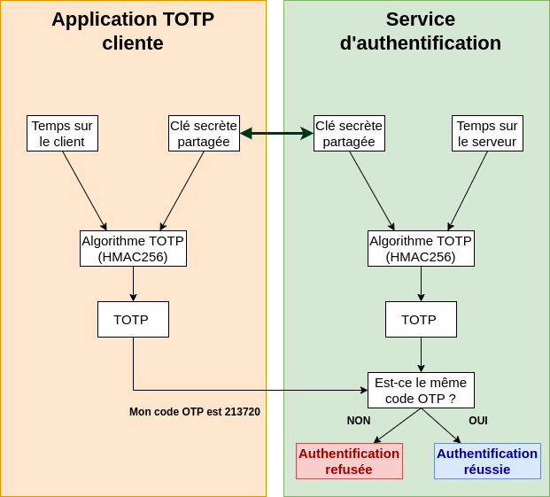

# Authentification TOTP sur Debian — Agence Frankfurt

## Objectif
Mettre en place une **authentification forte à deux facteurs (2FA)** sur l’ensemble des **serveurs Debian de l’agence Frankfurt**, afin de renforcer la sécurité des accès SSH par l’ajout d’un code temporaire généré par une application mobile (TOTP).

---

## 1. Principe du TOTP

Le **TOTP (Time-based One Time Password)** repose sur un **code unique généré toutes les 30 secondes** à partir :
- d’une **clé secrète partagée** entre le serveur et le client ;
- de l’horloge du système.

Ce code vient compléter le mot de passe habituel, ce qui empêche toute connexion même en cas de fuite du mot de passe principal.

---

## 2. Installation du module PAM TOTP

Sur chaque serveur Debian de l’agence Frankfurt :

```bash
sudo apt update
sudo apt install libpam-google-authenticator -y
```

Ce module permet d’intégrer Google Authenticator (ou tout autre outil compatible TOTP comme Authy, Aegis ou FreeOTP) dans le processus d’authentification PAM.

---

## 3. Configuration de l’utilisateur

L’utilisateur concerné (par exemple `admin-frankfurt`) génère sa clé TOTP :

```bash
google-authenticator
```

Le script affiche un QR Code à scanner avec l’application mobile.  
Conservez le code de secours (en cas de perte du téléphone).

!!! info
    Si le QR Code ne s’affiche pas bien dans le terminal, copiez la **clé secrète** affichée manuellement dans votre application TOTP.

---

## 4. Intégration avec SSH

Éditez le fichier PAM de SSH :
```bash
sudo nano /etc/pam.d/sshd
```
Ajoutez cette ligne en haut du fichier :
```
auth required pam_google_authenticator.so
```

Puis modifiez la configuration SSH :
```bash
sudo nano /etc/ssh/sshd_config
```

Activez le challenge de type TOTP :
```
ChallengeResponseAuthentication yes
```

Redémarrez le service SSH :
```bash
sudo systemctl restart ssh
```

---

## 5. Test de connexion

Depuis un autre poste :
```bash
ssh admin-frankfurt@<adresse_IP_serveur>
```

Le système demande :
1. le **mot de passe habituel**,  
2. puis le **code TOTP à 6 chiffres** généré sur votre téléphone.

Si le code est correct → connexion autorisée  
Sinon → refus d’accès

---

## 6. Schéma du fonctionnement

### Génération de la clé et association mobile :


### Connexion sécurisée via TOTP :


---

## 7. Bonnes pratiques

- Synchroniser régulièrement l’horloge de chaque serveur (`ntp` ou `systemd-timesyncd`) pour éviter les désynchronisations TOTP.  
- Configurer au minimum **deux comptes administrateurs** avec TOTP activé.  
- Sauvegarder la configuration PAM et SSH avant toute modification :
```bash
sudo cp /etc/pam.d/sshd /etc/pam.d/sshd.backup
sudo cp /etc/ssh/sshd_config /etc/ssh/sshd_config.backup
```

---

## Résultat attendu

- L’accès SSH de **tous les serveurs Debian de l’agence Frankfurt** est désormais protégé par une authentification à deux facteurs.  
- Chaque connexion nécessite un mot de passe **et** un code TOTP unique.  
- Cette configuration renforce significativement la sécurité du système d’information.
