# Situation1 - AdminServ - CUB
{ align=center width="250" }

## Mise en place de serveurs DNS au sein de l’entreprise CUB  

**Présenté par :** Joris Texier  
**Date de rédaction :** 2 octobre 2025  
**Version :** 1  

---

## Sommaire

- Étape 1  
  - Schéma réseau logique et fonctionnement du service DNS  
  - Explication du fonctionnement du DNS interne  
- Étape 2  
  - Mise en place du service DNS resolver (Unbound)  
  - Mise en place du service DNS faisant autorité (Bind9)  
  - Délégation de zone  
  - Tests de fonctionnement  

---

## Étape 1

### a) Schéma réseau et fonctionnement du DNS

À partir du schéma réseau logique initial réalisé les semaines précédentes, un nouveau schéma est proposé incluant le fonctionnement du **service DNS** au sein de l’entreprise.

Les éléments à prendre en compte :

- Une continuité de service doit être proposée pour le service DNS récursif (hébergé dans le VLAN production).  
- Une continuité de service doit être proposée pour le service DNS faisant autorité sur le domaine `frankfurt.cub.sioplc.fr` (hébergé dans le VLAN DMZ).
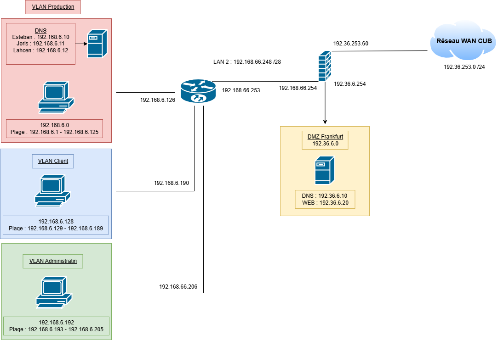{ align=center width="700" }

---

### b) Explication du fonctionnement DNS

Le fonctionnement du DNS dans l’entreprise CUB repose sur une architecture hiérarchisée entre un **DNS récursif interne (resolver)** et un **DNS faisant autorité**.  

Exemple : une machine cliente souhaite obtenir l’adresse IP correspondant au nom `ns1.frankfurt.cub.sioplc.fr`.  

Le processus est le suivant :

1. La machine cliente envoie la requête DNS au serveur récursif interne.  
2. Si l’adresse demandée n’est pas en cache, le serveur contacte un serveur DNS racine.  
3. Celui-ci renvoie la délégation vers les serveurs autoritaires du domaine `cub.sioplc.fr`.  
4. Le serveur récursif obtient la réponse finale et la renvoie au client.  


---

## Étape 2

### a) Mise en place du service DNS resolver (Unbound)

#### Vérification préalable

```bash
sudo apt update && sudo apt upgrade
```

Installer le service de journalisation **rsyslog** pour disposer de logs clairs dans `/var/log` :

```bash
sudo apt install rsyslog
```

#### Définir les paramètres réseaux du serveur

```bash
sudoedit /etc/network/interfaces
```
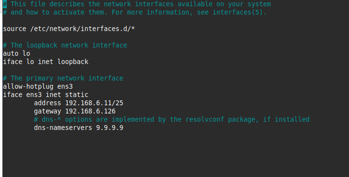{ align=center width="700" }


#### Définir le serveur DNS récursif à utiliser

```bash
sudoedit /etc/resolv.conf
nameserver 8.8.8.8
```

Une fois le service Unbound opérationnel, remplacer `8.8.8.8` par `127.0.0.1` et ajouter le second serveur récursif (`192.168.6.10`).

#### Prendre en compte les modifications

```bash
systemctl restart networking
```

#### Configurer les fichiers d’identité du serveur

```bash
sudoedit /etc/hostname
dns1
sudoedit /etc/hosts
sudo shutdown -r now
```
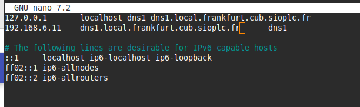{ align=center width="700" }

#### Installation d’Unbound et des outils

```bash
sudo apt install unbound dnsutils tcpdump tmux curl
```

#### Configuration d’Unbound

```bash
sudoedit /etc/unbound/unbound.conf
sudo unbound-checkconf
```
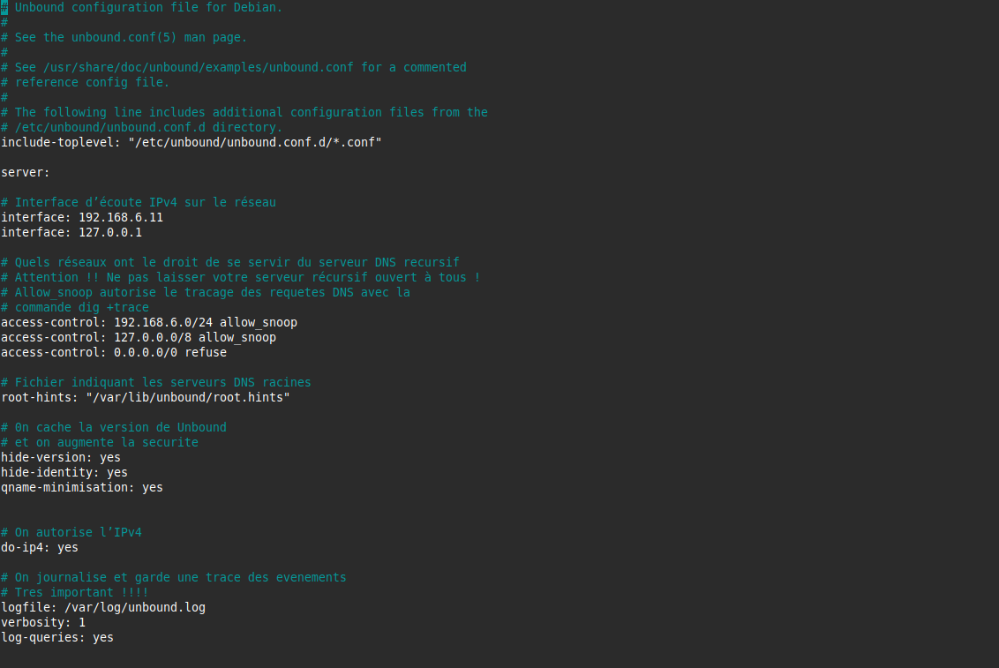{ align=center width="700" }

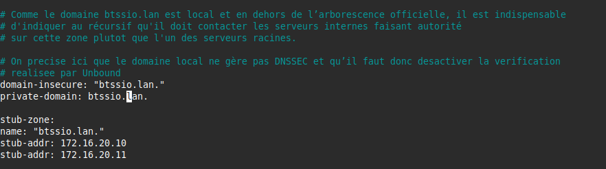{ align=center width="700" }

Téléchargement du fichier racine :

```bash
sudo curl --output /var/lib/unbound/root.hints https://www.internic.net/domain/named.cache
sudo chown -R unbound:unbound /var/lib/unbound/
```

Création du fichier de log :

```bash
sudo touch /var/log/unbound.log
sudo chown unbound:unbound /var/log/unbound.log
sudo systemctl restart unbound
sudo systemctl status unbound
```
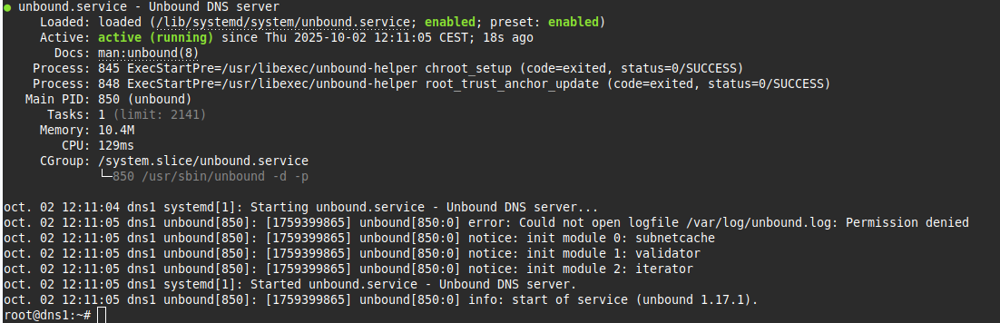{ align=center width="700" }

#### Sécurisation AppArmor

```bash
sudoedit /etc/apparmor.d/usr.sbin.unbound
# Autoriser le daemon à lire et écrire dans /var/log/unbound.log
/var/log/unbound.log rw,

sudo apparmor_parser -r /etc/apparmor.d/usr.sbin.unbound
sudo systemctl restart apparmor
```

Observation des logs :

```bash
sudo cat /var/log/unbound.log
sudo tail -f /var/log/unbound.log
```

#### Test de bon fonctionnement
*(Insérer capture ou résultat du test Unbound ici)*

---

### b) Mise en place du service DNS faisant autorité (Bind9)

Ce service s’exécute dans le VLAN DMZ (VLAN 76) et gère le domaine `frankfurt.cub.sioplc.fr`.  

#### Vérification préalable

```bash
sudo apt update && sudo apt upgrade
sudo apt install rsyslog bind9 dnsutils
```

#### Paramètres réseaux

```bash
sudoedit /etc/network/interfaces
sudoedit /etc/resolv.conf
nameserver 9.9.9.9
sudo systemctl restart networking
```
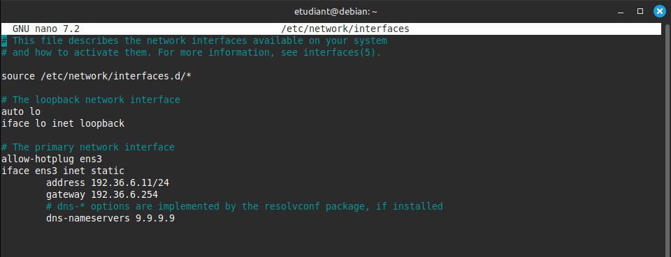{ align=center width="700" }

#### Configuration des fichiers d’identité

```bash
sudoedit /etc/hostname
ns1
sudoedit /etc/hosts
sudo shutdown -r now
```
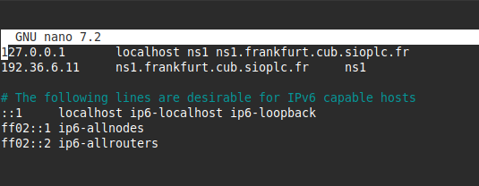{ align=center width="700" }

#### Exemple de configuration Bind9 (esclave)

```bash
sudoedit /etc/bind/named.conf.local
sudo touch /var/cache/bind/db.frankfurt.cub.sioplc.fr
sudo chown bind:bind /var/cache/bind/db.frankfurt.cub.sioplc.fr
```
{ align=center width="700" }

#### Mise en place de la journalisation

```bash
sudoedit /etc/bind/named.conf.log
sudo touch /var/log/bind.log
sudo chown bind:bind /var/log/bind.log
sudoedit /etc/bind/named.conf
```
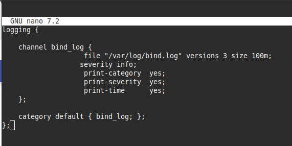{ align=center width="700" }

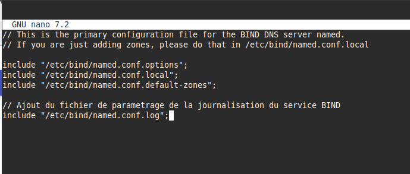{ align=center width="700" }


Configuration AppArmor :

```bash
sudoedit /etc/apparmor.d/usr.sbin.named
# Autoriser le daemon Bind 9 à lire et écrire dans /var/log/bind.log
/var/log/bind.log rw,
sudo apparmor_parser -r /etc/apparmor.d/local/usr.sbin.named
sudo systemctl restart apparmor
sudo named-checkconf -z
sudo systemctl restart bind9
sudo systemctl status bind9
```
{ align=center width="700" }

---

### TEST

Cette commande permet de tester la résolution DNS d’un domaine précis :

```bash
nslookup ns0.frankfurt.cub.sioplc.fr 192.36.6.10
```

Résultat attendu :
- `ns0.frankfurt.cub.sioplc.fr` → `192.36.6.11` (esclave)
- `ns1.frankfurt.cub.sioplc.fr` → `192.36.6.10` (maître)
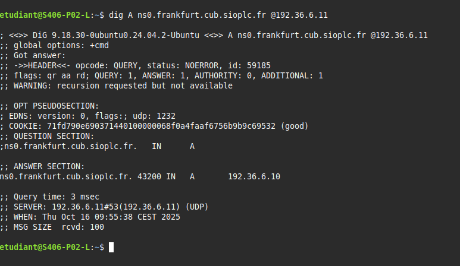{ align=center width="700" }

{ align=center width="700" }

---

### Délégation de zone

#### Connexion SSH au serveur maître parent

```bash
ssh admin@192.36.250.10
```
{ align=center width="700" }

#### Modification du fichier de zone du domaine parent

```bash
sudoedit /var/cache/bind/db.cub.sioplc.fr
```

Ajouter à la fin du fichier :
```
frankfurt     IN NS ns1.frankfurt.cub.sioplc.fr.
ns1.frankfurt IN A 192.36.6.11
```
{ align=center width="700" }


Vérifier et recharger la configuration :

```bash
sudo named-checkconf -z
sudo systemctl reload bind9
```


