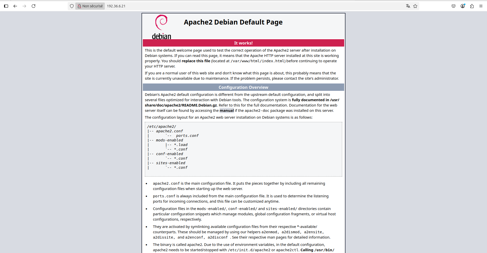
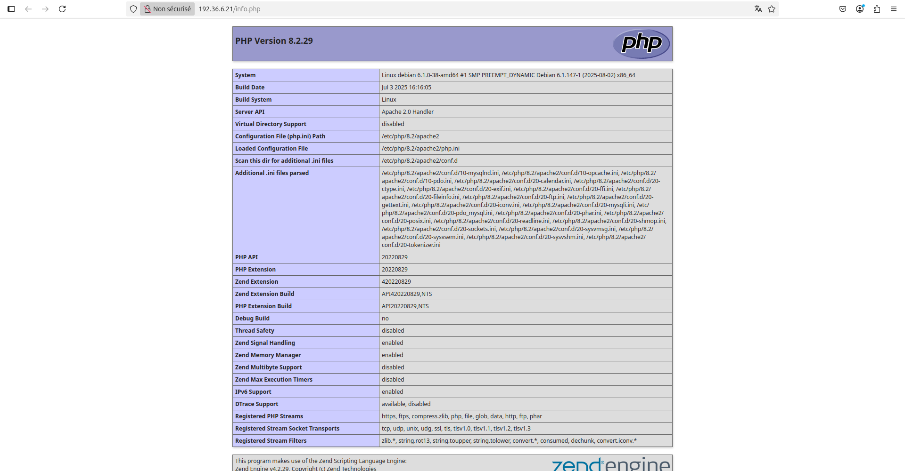
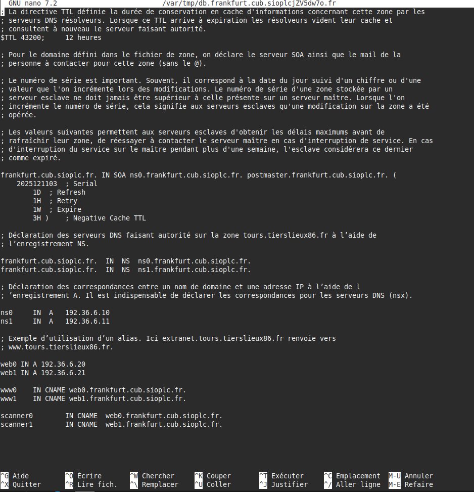
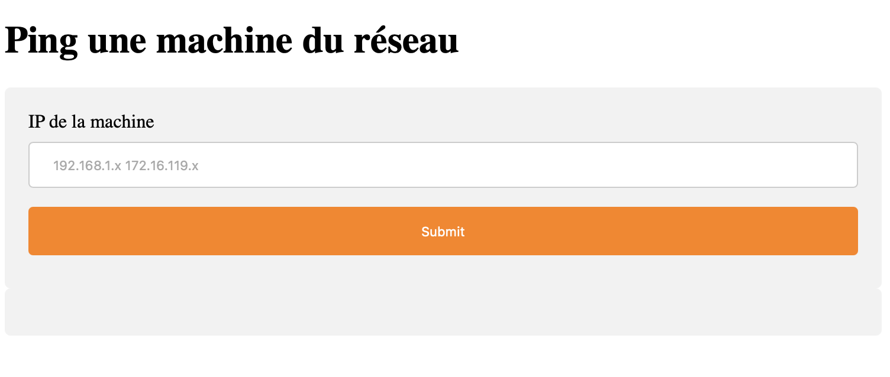

# Situation 2 – Administration des services – CUB
{ align=center width="250" }

## Mise en place d’un service Web au sein d’une agence de l’entreprise CUB

**Présenté par :** Joris Texier  
**Date de rédaction :** 13 novembre 2025  
**Version :** 1  

---

## Sommaire

- Serveur LAMP sous Debian 12  
  - Préparation du système  
  - Installation d’Apache  
  - Installation de MariaDB  
  - Installation de PHP  
- Mise en place des hôtes virtuels Apache (VirtualHost)  
- Installation et configuration de WordPress  
- Configuration DNS  
- Récupération d’un site depuis un dépôt Git  
- Sécurisation de l’accès au site scanner1  

---

## Serveur LAMP sous Debian 12

### Préparation du système

#### Mettre à jour le système

```bash
sudo apt update && sudo apt upgrade -y
```

#### Installer les paquets requis

```bash
sudo apt install wget curl -y
```

---

## Installation d’Apache

### Installer Apache

```bash
sudo apt install apache2 -y
```

### Démarrer et activer Apache

```bash
sudo systemctl start apache2
sudo systemctl enable apache2
```

### Vérifier le statut d’Apache

```bash
sudo systemctl status apache2
```

### Tester Apache

Accéder à l’adresse suivante depuis un navigateur :

```
http://votre_adresse_ip
```

Dans ce cas :
```
http://192.36.6.21
```
{ align=center width="700" }

---

## Installation de MariaDB

### Installer MariaDB

```bash
sudo apt install mariadb-server -y
```

### Démarrer et sécuriser MariaDB

```bash
sudo systemctl start mariadb
sudo mysql_secure_installation
```

Choisir **y** pour toutes les options proposées.

### Accéder à MariaDB

```bash
sudo mysql -u root -p
```

---

## Installation de PHP

### Installer PHP et les extensions nécessaires

```bash
sudo apt install php php-mysql libapache2-mod-php php-cli php-curl php-gd php-zip -y
```

### Vérifier l’installation de PHP

```bash
echo "<?php phpinfo(); ?>" | sudo tee /var/www/html/info.php
```

Accéder à :
```
http://192.36.6.21/info.php
```
{ align=center width="700" }

### Supprimer le fichier de test

```bash
sudo rm /var/www/html/info.php
```

---

## Mise en place des hôtes virtuels Apache (VirtualHost)

### Objectif

- Site WordPress : `www1.frankfurt.cub.sioplc.fr`
- Site scanner réseau sécurisé : `scanner1.frankfurt.cub.sioplc.fr`

### Création des dossiers

```bash
sudo mkdir -p /var/www/www1
sudo mkdir -p /var/www/html/scanner1
sudo chown -R www-data:www-data /var/www/www1
sudo chown -R www-data:www-data /var/www/html/scanner1
```

### VirtualHost www1

```apache
<VirtualHost *:80>
ServerName www1.frankfurt.cub.sioplc.fr
DocumentRoot /var/www/www1/wordpress

<Directory /var/www/www1/wordpress>
Options FollowSymLinks
AllowOverride All
Require all granted
</Directory>

ErrorLog ${APACHE_LOG_DIR}/www1-error.log
CustomLog ${APACHE_LOG_DIR}/www1-access.log combined
</VirtualHost>
```

```bash
sudo a2ensite www1.conf
```

---

### VirtualHost scanner1

```apache
<VirtualHost *:80>
ServerName scanner1.frankfurt.cub.sioplc.fr
DocumentRoot /var/www/html/scanner1

<Directory /var/www/html/scanner1>
Options FollowSymLinks
AllowOverride All
Require all granted
</Directory>

ErrorLog ${APACHE_LOG_DIR}/scanner1-error.log
CustomLog ${APACHE_LOG_DIR}/scanner1-access.log combined
</VirtualHost>
```

```bash
sudo a2ensite scanner1.conf
```

---

## Installation et configuration de WordPress

### Création de la base de données

```sql
CREATE DATABASE wordpress1 DEFAULT CHARACTER SET utf8mb4 COLLATE utf8mb4_unicode_ci;
CREATE USER 'wpuser1'@'localhost' IDENTIFIED BY 'Etudiant_007';
GRANT ALL PRIVILEGES ON wordpress1.* TO 'wpuser1'@'localhost';
FLUSH PRIVILEGES;
EXIT;
```

### Installation de WordPress

```bash
cd /tmp
wget https://fr.wordpress.org/latest-fr_FR.tar.gz
tar xvf latest-fr_FR.tar.gz
sudo mv wordpress /var/www/www1
sudo chown -R www-data:www-data /var/www/www1
sudo find /var/www/www1 -type d -exec chmod 750 {} \;
sudo find /var/www/www1 -type f -exec chmod 640 {} \;
```

### Configuration

Modifier `wp-config.php` :

```php
define( 'DB_NAME', 'wordpress1' );
define( 'DB_USER', 'wpuser1' );
define( 'DB_PASSWORD', 'Etudiant_007' );
define( 'DB_HOST', 'localhost' );
define( 'DB_CHARSET', 'utf8mb4' );
```

```bash
sudo systemctl restart apache2
```

---

## Configuration DNS

Modifier la zone DNS :

```bash
cd /var/cache/bind/db.frankfurt.cub.sioplc.fr
```
{ align=center width="700" }

---

## Récupération d’un site depuis un dépôt Git

```bash
apt install git -y
cd /var/www/html/scanner1
git clone https://github.com/kferrandonFulbert/command-attack.git .
```

---

## Sécurisation de l’accès au site scanner1

### Activer les modules Apache

```bash
sudo a2enmod auth_basic
sudo a2enmod authz_host
sudo systemctl restart apache2
```

### Créer le fichier htpasswd

```bash
sudo htpasswd -c /etc/apache2/.htpasswd admin
```

### VirtualHost sécurisé

```apache
AuthType Basic
AuthName "Accès restreint - Scanner Réseau"
AuthUserFile /etc/apache2/.htpasswd
Require valid-user
Require ip 192.168.6.192/28
```

```bash
sudo a2ensite scanner1.conf
sudo systemctl reload apache2
```

Accès :
```
http://scanner1.frankfurt.cub.sioplc.fr
```
{ align=center width="700" }
