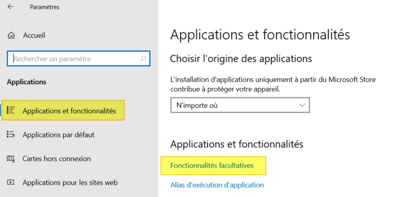

# Situation1 - AdminSys - CUB
.png){ align=center width="250" }

## Préparation de la maquette et premiers paramétrages du serveur Windows 2019

**Présenté par :** Joris Texier  
**Date de rédaction :** 03 septembre 2025  
**Version :** 1  

---

## Sommaire
- Réaliser un Sysprep pour réinitialiser le SID
- Changer le nom du serveur
- Modifier le VLAN et l'adresse IP
- Installation et configuration du service SSH
- Configurer OpenSSH Server sur Windows
- Configuration d'OpenSSH Server sur Windows
- Utiliser le client OpenSSH sur Windows
- Activer le Bureau à distance
- Création d’un nouvel utilisateur sous Windows 2019
- Interdiction de connexion SSH pour le compte administrateur
- Test de la connexion RDP pour le compte “adminssh”

---

## Réaliser un Sysprep pour réinitialiser le SID

Le sysprep est nécessaire pour réinitialiser le SID de Windows et permettre une configuration propre de la machine clonée.  
Cet utilitaire se trouve dans `C:\Windows\System32\Sysprep`.
{ align=center width="700" }

Sysprep s’utilise en mode graphique ou en ligne de commande.
{ align=center width="700" }
  
Quand tout se passe bien, il affiche une fenêtre de progression pendant plusieurs minutes.
{ align=center width="700" }
  
En cas d’erreur, un message s’affiche directement lors de l’exécution ou après quelques secondes.
{ align=center width="700" }

---

## Changer le nom du serveur

Redémarrer la machine virtuelle après le Sysprep.  
Ouvrir :  
**Gestionnaire de serveur > Serveur local > Nom de l’ordinateur**  
Nouveau nom : `ServeurPrimaire13`

---

## Modifier le VLAN et l’adresse IP
{ align=center width="700" }


---

## Installation et configuration du service SSH

L'installation d'OpenSSH Server sur Windows 10 ou Windows Server 2019 peut s'effectuer de deux façons :
- À partir de PowerShell  
- À partir de l'interface graphique  

OpenSSH Server correspond à une fonctionnalité facultative de Windows.

### Installation via l’interface graphique :
1. Ouvrir **Paramètres > Applications**
2. Cliquer sur **Fonctionnalités facultatives**
{ align=center width="700" }

3. Cliquer sur **Ajouter une fonctionnalité**
4. Rechercher **ssh**
5. Sélectionner **Serveur OpenSSH**
6. Cliquer sur **Installer**

Patientez pendant l’installation (quelques secondes).  
Aucun redémarrage n’est nécessaire.
{ align=center width="700" }

{ align=center width="700" }

---

## Configurer OpenSSH Server sur Windows

Pour démarrer et activer OpenSSH Server :

```powershell
Start-Service -Name "sshd"
Set-Service -Name "sshd" -StartupType Automatic
Get-Service -Name "sshd"
```
{ align=center width="700" }

---

## Configuration d’OpenSSH Server sur Windows

Les fichiers de configuration sont situés dans :  
`%programdata%\ssh\`

### Modifier le port d’écoute SSH

Pour changer le port par défaut (22) :

1. Ouvrir le fichier `sshd_config` en administrateur
2. Décommenter la ligne suivante et modifier le port :
   ```
   Port 222
   ```
{ align=center width="700" }

3. Sauvegarder le fichier

Redémarrer le service SSH pour appliquer la modification :

```powershell
Restart-Service "sshd"
```

### Ouvrir le port dans le pare-feu :

```powershell
New-NetFirewallRule -Name sshd -DisplayName 'OpenSSH Server (sshd) - Port 222' -Enabled True -Direction Inbound -Protocol TCP -Action Allow -LocalPort 222
```
{ align=center width="700" }

{ align=center width="700" }

---

## Utiliser le client OpenSSH sur Windows

Connexion SSH :

```bash
ssh administrateur@172.16.56.1 -p 222
```

Pour ouvrir une session PowerShell :

```bash
powershell.exe
```
{ align=center width="700" }

---

## Activer le Bureau à distance

Par défaut, le Bureau à distance est désactivé.

### Sous Windows Server :
1. Aller dans **Gestionnaire de serveur > Serveur local**

2. Dans la section **Bureau à distance**, cliquer sur **Désactivé**
{ align=center width="700" }

3. Sélectionner **Autoriser les connexions à distance à cet ordinateur**
{ align=center width="700" }

### Ou via les paramètres système :
1. Ouvrir **Paramètres > Système > Bureau à distance**
2. Activer **Bureau à distance**
3. Lancer **Connexion Bureau à distance**
{ align=center width="700" }

---

## Création d’un nouvel utilisateur sous Windows 2019

- Nom : `adminssh`  
- Mot de passe : `Cub_Admin_Ssh_007`
{ align=center width="700" }

---

## Interdiction de connexion SSH pour le compte administrateur

Dans le fichier `sshd_config`, commente ces lignes :

```
# Match Group administrators
# AuthorizedKeysFile __PROGRAMDATA__/ssh/administrators_authorized_keys
```

Puis ajoute :

```
DenyUsers Administrateur
```
{ align=center width="700" }


Cela empêche le compte `Administrateur` de se connecter via SSH.
{ align=center width="700" }

---

## Test de la connexion RDP pour le compte “adminssh”

Changer le type de compte de `adminssh` de “utilisateur standard” à “administrateur”  
afin d’autoriser la connexion RDP au poste.
{ align=center width="700" }

{ align=center width="700" }

---
