# Situation2 - AdminSys - CUB
{ align=center width="250" }

## Mise en place et découverte d’un environnement de développement Git

**Présenté par :** Joris Texier  
**Date de rédaction :** 17 septembre 2025  
**Version :** 1  

---

## Sommaire
- Partie 1 : Installation de l’environnement Git  
- Partie 2 : Initialisation de l’environnement Git  
- Partie 3 : Gérer les versions (commits) en local  
- Partie 4 : Gérer les dépôts sur GitHub à distance  

---

## Partie 1 : Installation de l’environnement Git
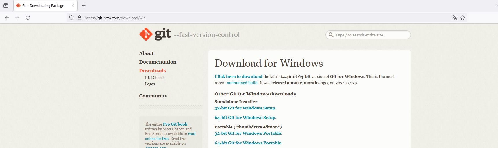{ align=center width="700" }

### Installation de Git sur le serveur

Une fois l’installation terminée, ouvrez le logiciel **Git**.
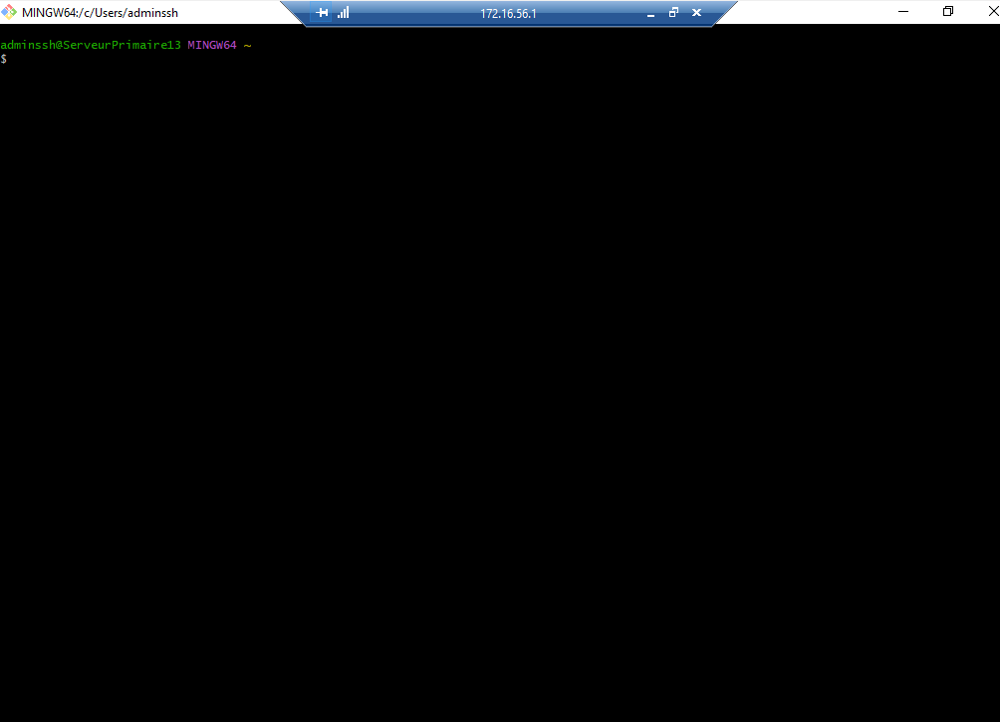{ align=center width="700" }
  
Pour vérifier que **Git Bash**, **Git GUI** et **Git CMD** sont bien installés, lancez Git Bash et testez une première commande :
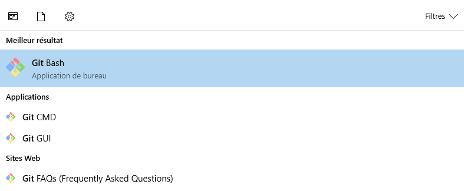{ align=center width="700" }

```bash
git version
```
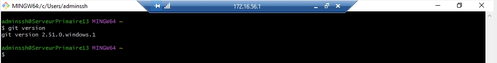{ align=center width="700" }

Créez ensuite un dossier à la racine de votre disque local via Git Bash nommé **git_cub1**.  
Celui-ci contiendra l’ensemble de vos dépôts.
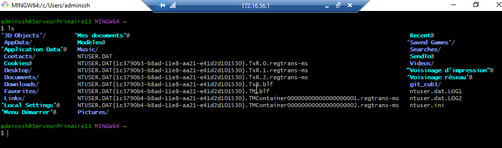{ align=center width="700" }


Créez un compte à votre nom sur le site [GitHub](https://github.com).
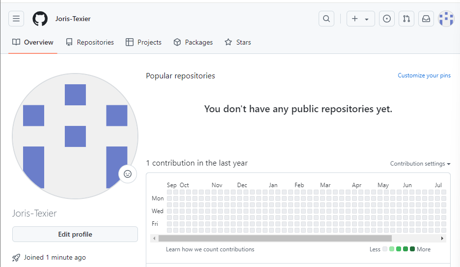{ align=center width="700" }

---

## Partie 2 : Initialisation de l’environnement Git

Préparation de la configuration initiale de Git en local, qui sera conservée pour tous vos projets :

```bash
git config --global user.name "Joris Texier"
git config --global user.email "joristexier37290@gmail.com"
```

Vérifier la prise en compte des informations :

```bash
git config --global --list
```
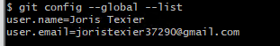{ align=center width="700" }

Vérifier l’accès à l’aide des commandes `git` ou `git --help`.

Positionnez-vous dans le dossier `git_cub1` :

```bash
cd git_cub1
```

Initialiser un premier dépôt local :

```bash
mkdir premierdepot
cd premierdepot
git init
```
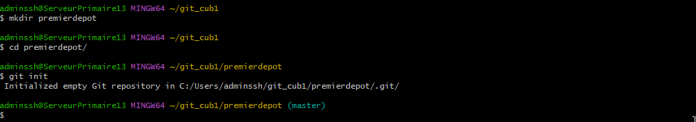{ align=center width="700" }

---

## Partie 3 : Gérer les versions (commits) en local

### Création d’un premier script

Créer un fichier **script0.bat** dans le dossier `premierdepot` :

```bash
nano script0.bat
```

Y insérer le contenu suivant :

```batch
@echo off
echo Ceci est mon premier script sous git
netstat -ano
pause
```

Enregistrer avec `Ctrl + O`, puis quitter avec `Ctrl + X`.

---

### Valider la première version

Ajouter le fichier dans la zone de préparation (index) :

```bash
git add .
# ou
git add --patch script0.bat
```

Vérifier l’état du dépôt :

```bash
git status
```
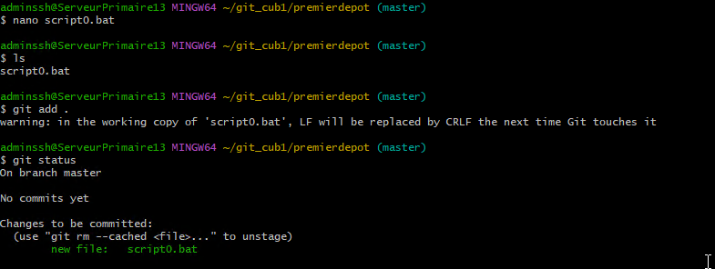{ align=center width="700" }

Réaliser le premier commit :

```bash
git commit -m "mon premier commit"
```
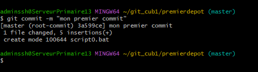{ align=center width="700" }

Vérifier de nouveau le statut :

```bash
git status
```
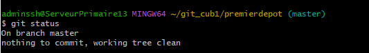{ align=center width="700" }


Lister les commits :

```bash
git log
```
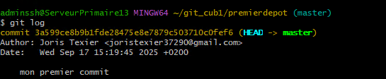{ align=center width="700" }


---

### Modifier le script

Éditer le fichier `script0.bat` :

```batch
@echo off
echo Ceci est mon premier script sous git
netstat -ano
ipconfig
pause
```

Ajouter la modification :

```bash
git add .
```
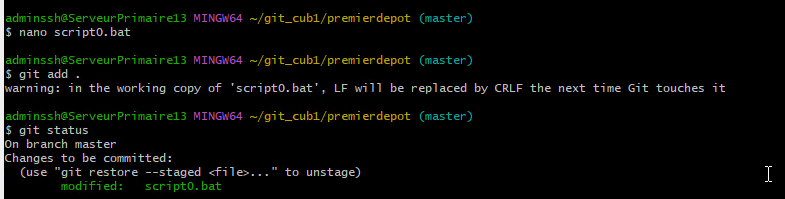{ align=center width="700" }

Créer un second commit :

```bash
git commit -m "mon deuxième commit"
```

Lister les versions du dépôt :

```bash
git log
```
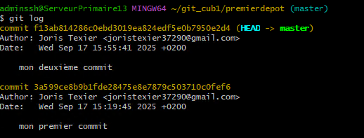{ align=center width="700" }

---

### Revenir à une version précédente

Pour revenir à la première version du script :

```bash
git checkout 3a599ce
```
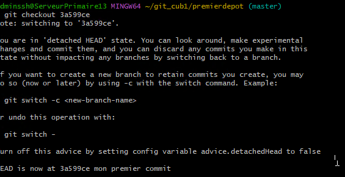{ align=center width="700" }

Puis revenir à la version la plus récente (branche principale) :

```bash
git checkout master
```
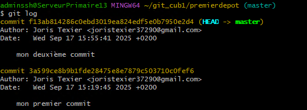{ align=center width="700" }

---

## Partie 4 : Gérer les dépôts sur GitHub à distance

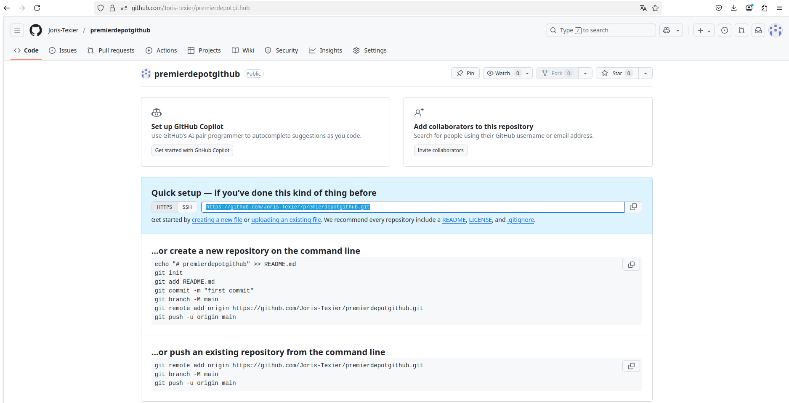{ align=center width="700" }

### Cloner un dépôt distant

```bash
git clone https://github.com/Joris-Texier/premierdepotgithub
```
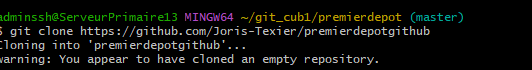{ align=center width="700" }

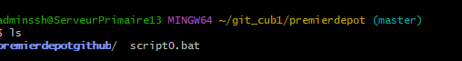{ align=center width="700" }

Lien du dépôt GitHub :  
🔗 [https://github.com/Joris-Texier/premierdepotgithub](https://github.com/Joris-Texier/premierdepotgithub)

---

### Copier un fichier dans le dépôt GitHub local

```bash
cp script0.bat /C/Users/adminssh/git_cub1/premierdepot/premierdepotgithub
```
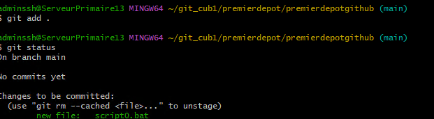{ align=center width="700" }

---

## Résumé des commandes principales utilisées

| Action | Commande |
|--------|-----------|
| Vérifier la version de Git | `git version` |
| Configurer le nom | `git config --global user.name "Joris Texier"` |
| Configurer l’adresse mail | `git config --global user.email "joristexier37290@gmail.com"` |
| Initialiser un dépôt local | `git init` |
| Ajouter un fichier | `git add .` |
| Valider une version | `git commit -m "message"` |
| Voir les commits | `git log` |
| Changer de version | `git checkout <id_commit>` |
| Cloner un dépôt distant | `git clone <url>` |

---


