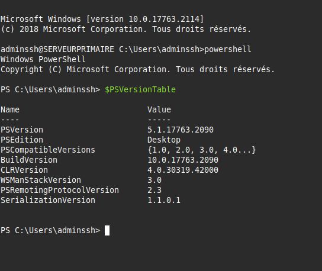

# Situation3 - AdminSys - CUB
{ align=center width="250" }

## Introduction au PowerShell

**Présenté par :** Joris Texier  
**Date de rédaction :** 1 octobre 2025  
**Version :** 1  

---

## Sommaire

- Question  
- Procédure : Gestion des droits utilisateurs sur un dossier avec PowerShell  
  - Objectif  
  - Préparer l’environnement  
  - Vérifier les droits actuels d’un dossier  
  - Ajouter ou modifier les droits d’un utilisateur  
  - Explications  
  - Autres types de droits disponibles  
  - Supprimer un droit d’accès  
  - Remplacer toutes les permissions existantes  
  - Vérifier les modifications  
  - Bonnes pratiques  

---

## Question

1. Connectez-vous en SSH puis exécutez et vérifiez la version de votre PowerShell :

```bash
ssh adminssh@192.168.6.1 -p 222
```
{ align=center width="700" }

2. PowerShell est exécuté lorsqu’il y a le préfixe **PS** devant la ligne de commande.  
3. `Get-Alias`  
4. `Clear-Host -?`  
5. Cmdlets, alias et fonctions  
6. Voir l’historique des commandes :  
   ```bash
   Get-History
   ```
7. Lister les processus :  
   ```bash
   Get-Process
   ```
   → Vérifiez si des processus suspects ne sont pas en exécution.  
8. Lister toutes les commandes :  
   ```bash
   Get-Command
   ```
9. Gérer les services :
   ```bash
   Stop-Service -Name "NOM DU SERVICE"
   Start-Service -Name "NOM DU SERVICE"
   Get-Service -Name "NOM DU SERVICE"
   ```
10. Créer un dossier :
   ```bash
   New-Item -Name "Procédures" -ItemType Directory
   Move-Item .\Procédures -Destination "C:/"
   ```
11. Créer un fichier texte :
   ```bash
   New-Item -Name "liste des procédures.txt" -ItemType File -Value "test"
   ```
12. Ajouter du contenu au fichier :
   ```bash
   Add-Content -Path "liste des procédures.txt" -Value "Administration à distance sécurisée"
   Add-Content -Path "liste des procédures.txt" -Value "Commandes PowerShell"
   ```
13. Copier un fichier :
   ```bash
   Copy-Item -Path "liste des procédures.txt" -Destination "C:\Procédures\ListeProceduresSauvegarde.txt"
   ```

---

## Procédure : Gestion des droits utilisateurs sur un dossier avec PowerShell

### Objectif

Cette procédure décrit les commandes PowerShell permettant d’ajouter, de modifier, de supprimer ou de consulter les droits d’accès des utilisateurs sur un dossier dans un environnement Windows.

---

### Préparer l’environnement

Ouvrez PowerShell **en tant qu’administrateur** pour disposer des droits nécessaires à la gestion des permissions.

---

### Vérifier les droits actuels d’un dossier

Afficher les permissions existantes sur un dossier :

```powershell
Get-Acl "C:\Chemin\Du\Dossier"
```

**Exemple :**
```powershell
Get-Acl "C:\Partage"
```

→ Cette commande retourne la liste des utilisateurs et leurs droits (Lecture, Écriture, Contrôle total, etc.).

---

### Ajouter ou modifier les droits d’un utilisateur

1. Récupérer l’ACL actuelle.  
2. Créer une nouvelle règle d’accès.  
3. L’appliquer au dossier.

**Exemple complet :**

```powershell
$acl = Get-Acl "C:\Partage"
$rule = New-Object System.Security.AccessControl.FileSystemAccessRule("NomUtilisateur","FullControl","Allow")
$acl.AddAccessRule($rule)
Set-Acl "C:\Partage" $acl
```

#### Explications :
- `"NomUtilisateur"` : nom de l’utilisateur ou du groupe (ex. Administrateurs, DOMAIN\Jean)
- `"FullControl"` : type d’accès (voir ci-dessous)
- `"Allow"` : type d’autorisation (possible aussi : `"Deny"`)

---

### Autres types de droits disponibles

| Type | Description |
|------|--------------|
| Read | Lecture |
| Write | Écriture |
| Modify | Modifier |
| FullControl | Contrôle total |

---

### Supprimer un droit d’accès

Pour retirer un droit déjà attribué :

```powershell
$acl = Get-Acl "C:\Partage"
$rule = New-Object System.Security.AccessControl.FileSystemAccessRule("NomUtilisateur","FullControl","Allow")
$acl.RemoveAccessRule($rule)
Set-Acl "C:\Partage" $acl
```

⚠️ La règle spécifiée doit être **identique** à celle ajoutée pour pouvoir être supprimée.

---

### Remplacer toutes les permissions existantes

Pour supprimer toutes les autorisations actuelles et ne garder que celles définies :

```powershell
$acl = New-Object System.Security.AccessControl.DirectorySecurity
$rule = New-Object System.Security.AccessControl.FileSystemAccessRule("NomUtilisateur","FullControl","Allow")
$acl.AddAccessRule($rule)
Set-Acl "C:\Partage" $acl
```

⚠️ Attention : cette méthode **efface toutes les permissions précédentes**.

---

### Vérifier les modifications

Après chaque modification, vérifiez l’ACL pour confirmer les changements :

```powershell
Get-Acl "C:\Partage" | Format-List
```

---

### Bonnes pratiques

- Toujours effectuer un `Get-Acl` avant de modifier les droits pour garder une trace.  
- Utiliser des **groupes** plutôt que des utilisateurs individuels pour une meilleure gestion.  
- Documenter toutes les modifications dans un journal d’administration.  

---


