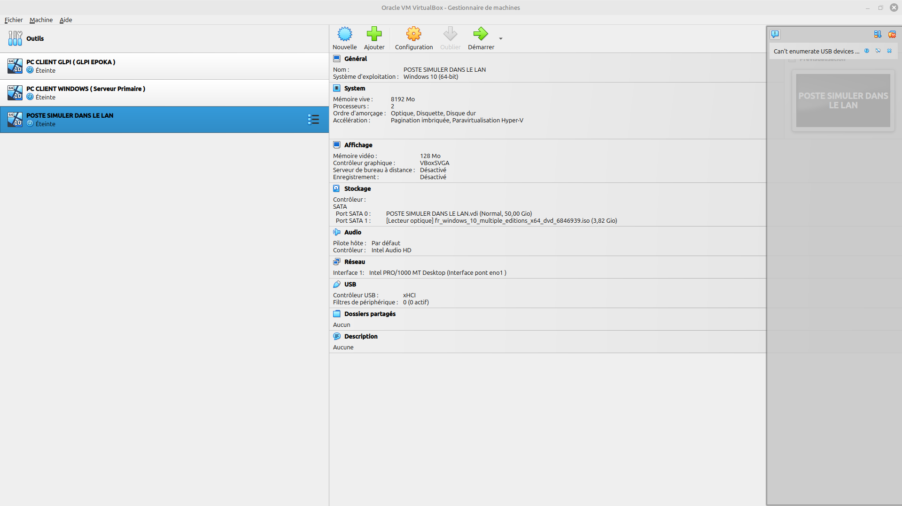
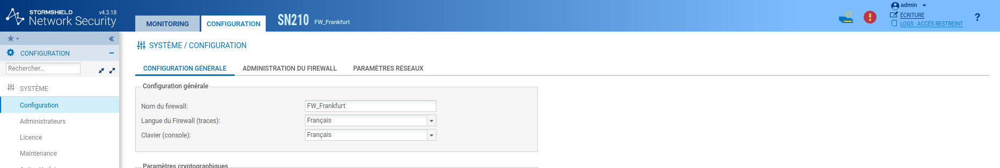
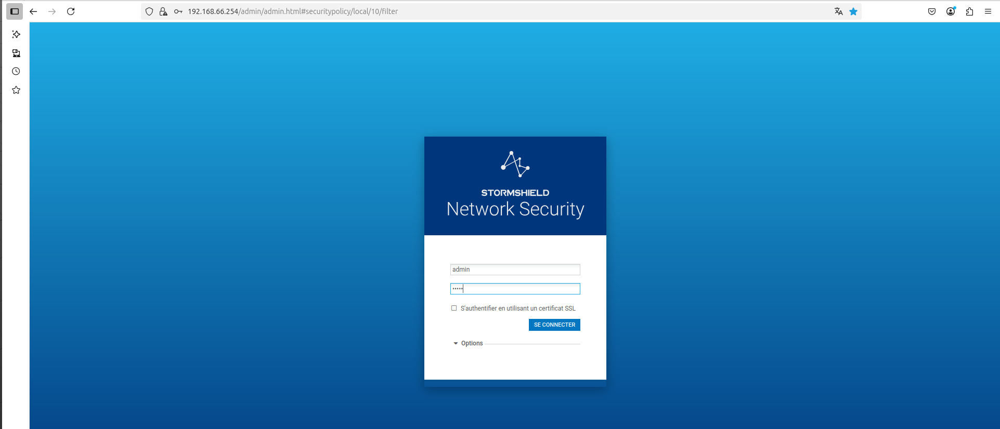
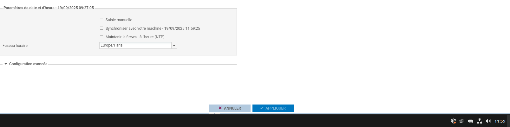
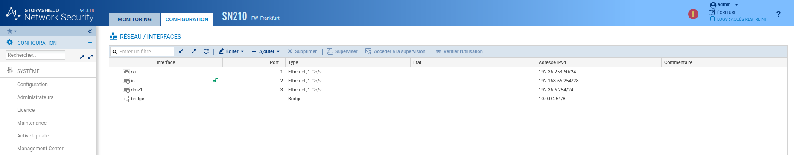
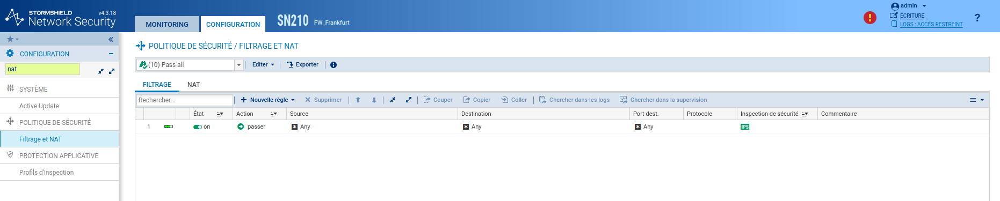

# Situation2 - Cyber - CUB
{ align=center width="250" }

## Premiers paramétrages d’un pare-feu sur un site de l’entreprise  

**Présenté par :** Joris Texier  
**Date de rédaction :** 19 septembre 2025  
**Version :** 1  

---

## Sommaire

- Installation des 3 VM et paramétrages de leurs cartes réseaux  
- Renommage du pare-feu  
- Identifiant / Mot de passe du pare-feu  
- Fuseau horaire : Europe/Paris  
- Synchronisation des pare-feu de l'entreprise CUB sur les serveurs NTP de Stormshield  
- Configuration des interfaces réseaux  
- Filtrage NAT  
- Recette de la situation  

---

## Installation des 3 VM et paramétrages de leurs cartes réseaux
{ align=center width="700" }

---

## Renommage du pare-feu
{ align=center width="700" }

---

## Identifiant / Mot de passe du pare-feu

| Élément | Valeur |
|----------|--------|
| **Login** | admin |
| **Mot de passe** | admin |
{ align=center width="700" }

---

## Fuseau horaire : Europe/Paris

Le pare-feu doit être configuré sur le fuseau horaire **Europe/Paris**.
{ align=center width="700" }
  
Une fois la modification effectuée, **redémarrer le pare-feu** pour appliquer les changements.
{ align=center width="700" }

---

## Synchronisation des pare-feu de l'entreprise CUB sur les serveurs NTP de Stormshield

La synchronisation des pare-feu de l'entreprise CUB sur les **serveurs NTP de Stormshield** est cruciale pour plusieurs raisons :

- 🕒 **Précision des logs** : assurer des horodatages cohérents pour faciliter les audits et l’analyse d’incidents.  
- 🔐 **Cohérence des règles de sécurité** : appliquer correctement les règles basées sur des créneaux horaires.  
- 🧩 **Corrélation des événements** : synchroniser les événements entre plusieurs sites pour une analyse efficace.  
- 🛰️ **Intégration avec d'autres systèmes de sécurité** : garantir la cohérence des données avec les outils de surveillance.  
- ⚙️ **Mises à jour programmées** : éviter les interruptions imprévues.  
- 🔏 **Certificats et authentification** : garantir le bon fonctionnement des protocoles de sécurité dépendant du temps.  

---

## Configuration des interfaces réseaux
{ align=center width="700" }

---

## Filtrage NAT
{ align=center width="700" }

---

## Recette de la situation

Résumé des tâches effectuées :

1. Installation des 3 VM et paramétrages réseau  
2. Renommage du pare-feu  
3. Définition des identifiants  
4. Configuration du fuseau horaire  
5. Synchronisation avec les serveurs NTP Stormshield  
6. Configuration des interfaces réseau  
7. Mise en place du filtrage NAT  
8. Validation du bon fonctionnement

---

