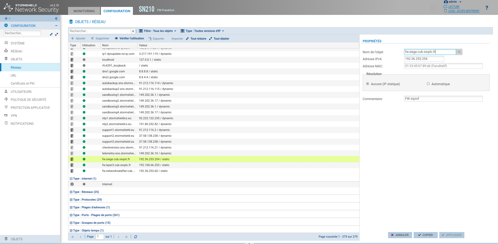
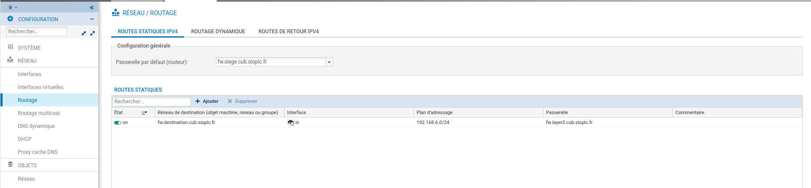
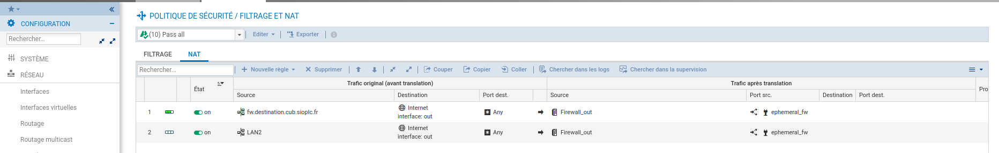
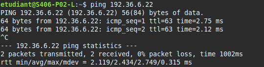
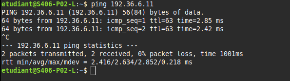

# Situation3 - Cyber - CUB
{ align=center width="250" }

## Routage et NAT  

**Présenté par :** Joris Texier  
**Date de rédaction :** 24 septembre 2025  
**Version :** 1  

---

## Sommaire

- Table de routage FW-Frankfurt  
- Implémentation de la table de routage sur le pare-feu  
- Mise en place du NAT pour la communication WAN/Internet  
- Test de connectivité  
- Accès aux services WEB et FTP depuis le WAN  
- Recette de la situation  
- Objets réseaux utilisés  

---

## Table de routage FW-Frankfurt  

### Pare-feu Stormshield  

| Type | Réseau de destination | Masque de sous-réseau | Passerelle | Interface |
|------|------------------------|------------------------|-------------|------------|
| Connecté | 192.36.6.0 | /24 | 192.36.6.254 | 192.36.6.254 |
| Connecté | 192.36.253.0 | /24 | 192.36.253.60 | 192.36.253.60 |
| Connecté | 192.168.66.248 | /28 | 192.168.66.254 | 192.168.66.254 |
| Statique | 192.168.6.0 | /24 | 192.168.66.253 | 192.168.66.254 |
| Statique | 0.0.0.0 | /0 | 192.36.253.254 | 192.36.253.60 |

💡 **L’adresse IP du WAN utilisée comme passerelle vers Internet est : `192.36.253.254`**
{ align=center width="700" }

---

## Implémentation de la table de routage sur le pare-feu  

{ align=center width="700" }

---

## Mise en place du NAT – Communication WAN/Internet  

Pour permettre aux adresses IP privées du site de communiquer sur le réseau WAN public et Internet, on met en place un **filtrage NAT**.  
Celui-ci permet de translater les adresses IP privées en adresses publiques.

### Configuration du NAT sur le pare-feu Stormshield  

| Avant Translation | Après Translation |
|-------------------|-------------------|
| ip source 192.168.6.0/24 → ip dest 192.36.253.60 |
| ip source 192.168.66.240/28 → ip dest 192.36.253.60 |

{ align=center width="700" }
---

## Test de connectivité  

- **Ping 1 :** depuis une machine hôte sur le VLAN client (`192.168.6.132/26`) vers le **serveur WEB** (`192.36.6.22/24`) dans la DMZ publique.  

{ align=center width="700" }

- **Ping 2 :** depuis la même machine hôte vers le **serveur DNS** (`192.36.6.11/24`) dans la DMZ publique.
  
{ align=center width="700" }

✅ Les tests doivent confirmer que la connectivité via le pare-feu et le NAT fonctionne correctement.

---

## Accès aux services WEB et FTP depuis le WAN  

Pour permettre aux services **WEB** et **FTP** de la DMZ d’être accessibles depuis le réseau WAN :

1. Mettre en place un **DNAT** de l’IP publique vers les IP des serveurs DMZ (HTTP, HTTPS, FTP).  
2. Autoriser uniquement ces flux spécifiques sur le pare-feu.  
3. Configurer le **FTP en mode passif**.  
4. Sécuriser les échanges via **TLS** et filtrage applicatif.

---

## Recette de la situation  

- Table de routage configurée sur le pare-feu.  
- NAT fonctionnel pour la communication externe.  
- DNAT actif pour les services WEB et FTP.  
- Tests de connectivité validés.  
- Configuration conforme aux besoins de l’entreprise CUB.  

---

