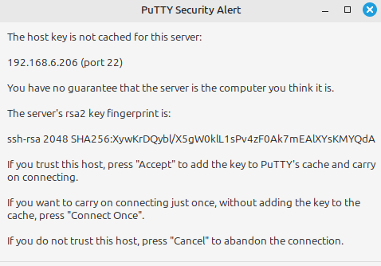
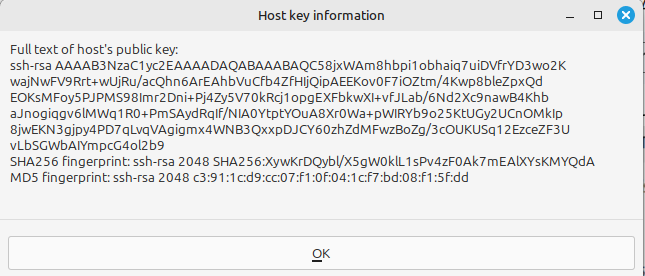
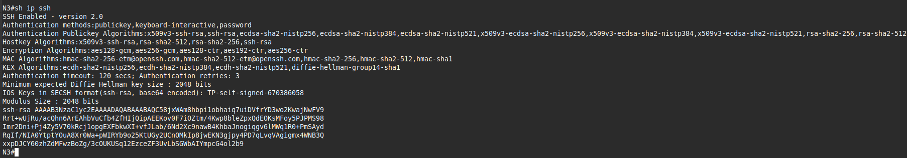
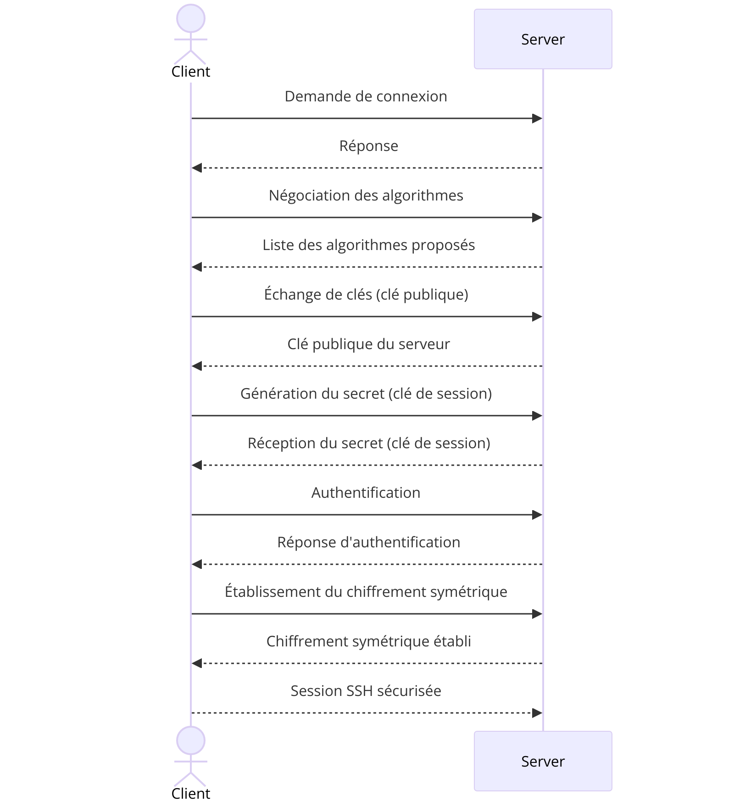
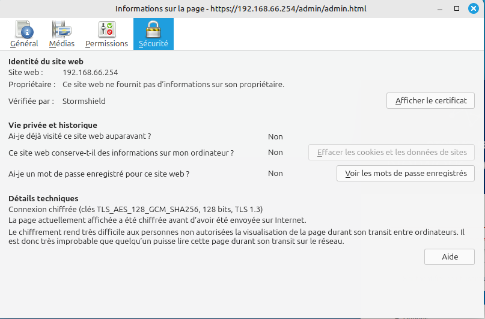
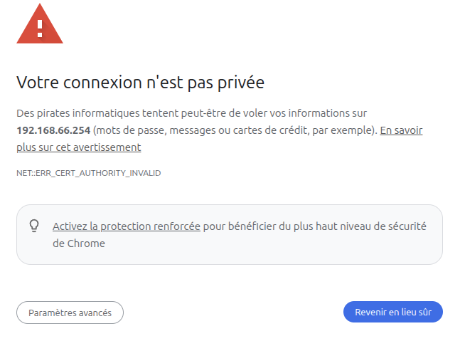

# Situation4 - Cyber - CUB
{ align=center width="250" }
## Cryptographie  

**Présenté par :** Joris Texier  
**Date de rédaction :** 1 octobre 2025  
**Version :** 1  

---

## Sommaire

- Accès SSH commutateur de niveau 3 et niveau 2  
- Critères de sécurité  
- Prouver l’intégrité et l’identité des matériels  
- Algorithme de chiffrement utilisé par le serveur SSH  
- Diagramme de séquence entre le client et le serveur lors d’une connexion SSH  
- Connexion en HTTPS sur le pare-feu Stormshield  
- Rôle d’une autorité de certification (reconnue ou non) : avantages et inconvénients  

---

## Accès SSH commutateur de niveau 3 et niveau 2

### Switch N3

```bash
Switch(config)#ip domain name btssio.lan
Switch(config)#interface vlan 20
Switch(config-if)#no sh
Switch(config-if)#ip address 192.168.6.206 255.255.255.240
Switch(config-if)#exit
Switch(config)#username etudiant
Switch(config)#username etudiant privilege 15 secret etudiant_007
Switch(config)#crypto key generate rsa
How many bits in the modulus [1024]: 2048
Switch(config)#ip ssh version 2
Switch(config)#line vty 0 4
Switch(config-line)#transport input ssh
Switch(config-line)#login local
Switch(config-line)#do write
Building configuration...
[OK]
Switch(config-line)#
```

### Switch N2

```bash
Switch(config)#ip domain name btssio.lan
Switch(config)#interface vlan 20
Switch(config-if)#no sh
Switch(config-if)#ip address 192.168.6.205 255.255.255.240
Switch(config-if)#exit
Switch(config)#username etudiant
Switch(config)#username etudiant privilege 15 secret etudiant_007
Switch(config)#crypto key generate rsa
How many bits in the modulus [1024]: 2048
Switch(config)#ip ssh version 2
Switch(config)#line vty 0 4
Switch(config-line)#transport input ssh
Switch(config-line)#login local
Switch(config-line)#do write
Building configuration...
[OK]
Switch(config-line)#
```

---

## Critères de sécurité

Le protocole **SSH** garantit l'intégrité des données grâce à l'utilisation de **HMAC** et de l'algorithme **SHA-2**, assurant que les messages n'ont pas été modifiés.  
Il authentifie l'origine des communications via un système de clés asymétriques, permettant de vérifier l'identité des utilisateurs et des serveurs.  
La confidentialité est assurée par un chiffrement symétrique **AES**, renforcé par un échange de clés asymétriques via **RSA** ou **Diffie-Hellman**.  
De plus, SSH offre une **non-répudiation** en utilisant des signatures numériques, rendant impossible pour l'expéditeur de nier l'envoi d'un message.  

De son côté, **RDP** garantit également l'intégrité des données en utilisant **TLS avec SHA-2**.  
L'authentification est réalisée grâce à TLS et peut être renforcée avec **Kerberos**, assurant que les parties communicantes sont bien celles qu'elles prétendent être.  
La confidentialité des communications est assurée par le chiffrement **AES via TLS**.  
Cependant, RDP ne dispose pas nativement de mécanismes de non-répudiation, sauf lorsqu'il est combiné à TLS/Kerberos.

➡️ En résumé, **SSH** répond pleinement aux quatre critères de sécurité (**intégrité, authentification, confidentialité, non-répudiation**), tandis que **RDP**, bien que sécurisé, reste plus limité sur le plan de la non-répudiation directe.

---

## Prouver l’intégrité et l’identité des matériels

1. Ouvrir **PuTTY** et entrer l’adresse IP de la passerelle du switch N3 : `192.168.6.206`
{ align=center width="700" }

2. Cliquer sur **More info...**
{ align=center width="700" }

3. Comparer ensuite l’empreinte affichée avec celle du switch via la commande :
```bash
show ip ssh
```
{ align=center width="700" }

✅ Si les empreintes sont identiques, l’intégrité et l’identité sont vérifiées.

---

## Algorithme de chiffremet utilisé par le serveur SSH

L’algorithme de chiffrement utilisé par le serveur SSH est : **SHA256**

{ align=center width="150" }

---

## Diagramme de séquence entre le client et le serveur lors d’une connexion SSH
{ align=center width="700" }

### Différence entre échanges asymétriques et symétriques
- **Échanges asymétriques :** utilisent une paire de clés publique/privée (RSA, DSA, ECDSA).  
  Utilisés au début de la session (authentification et échange de clé).  
- **Échanges symétriques :** utilisent une clé secrète partagée (AES, ChaCha20).  
  Utilisés pour chiffrer les données une fois le canal sécurisé établi.  

---

## Connexion en HTTPS sur le pare-feu Stormshield
{ align=center width="700" }

Lors de la première connexion HTTPS à l’interface du **pare-feu Stormshield**, une alerte apparaît dans le navigateur (Chrome ou Firefox).

Ce message s’explique par le fait que :

- L’accès se fait via une adresse IP locale (`192.168.66.254`) et non un nom de domaine reconnu.  
- Le pare-feu utilise un **certificat auto-signé** pour chiffrer la connexion HTTPS.  
- Ce certificat **n’est pas émis par une autorité de certification reconnue**.  

Le navigateur considère donc l’identité du site comme non vérifiable et affiche une alerte pour prévenir d’un risque potentiel (attaque MITM).
{ align=center width="700" }
---

## Rôle d’une autorité de certification et différence entre reconnue et non-reconnue

Une **autorité de certification (CA)** garantit la sécurité et la confiance dans les échanges numériques.  
Elle délivre des certificats électroniques permettant de vérifier l’identité d’un site ou d’un équipement, d’assurer l’intégrité des données transmises et de chiffrer les communications.

### Types d’autorités

- **Reconnue :**  
  Certificats intégrés aux navigateurs et systèmes (ex. : DigiCert, GlobalSign, Let’s Encrypt).  
  ➕ Reconnaissance automatique, pas d’alerte de sécurité.  
  ➖ Peut être payante ou dépendante d’un tiers.

- **Non reconnue :**  
  Certificats internes ou auto-signés (générés en local).  
  ➕ Gratuits, autonomes, idéals pour un usage interne.  
  ➖ Déclenchent des alertes de sécurité, nécessitent l’installation manuelle sur chaque poste.

### En résumé

- Pour un service **interne**, un certificat auto-signé peut suffire.  
- Pour un service **public ou externe**, une autorité reconnue est indispensable pour éviter les alertes et inspirer confiance.

---

